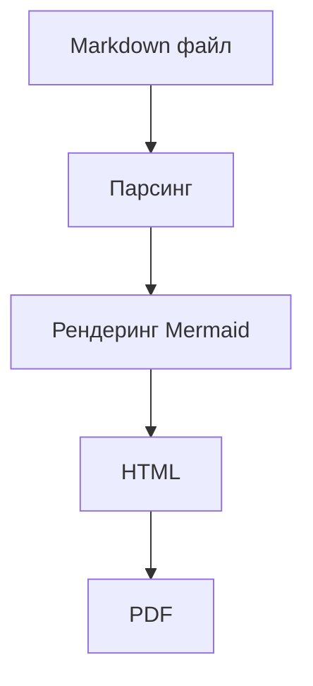

# MD2PDF Converter

Конвертер Markdown → PDF с поддержкой диаграмм Mermaid, красивым GUI и экспортом диаграмм в ZIP-архив.

## Возможности

- 📄 Конвертация `.md` файлов в PDF с сохранением форматирования
- 🔷 Поддержка диаграмм Mermaid (flowchart, sequence, gantt и др.)
- 🖼️ Экспорт всех диаграмм в ZIP-архив (PNG)
- 🖱️ Drag-and-drop загрузка файлов
- 📐 Выбор формата страницы: A3, A4, A5, Letter, Legal
- 🔍 Масштабирование диаграмм
- ⛔ Отмена конвертации в процессе
- 🖥️ Поддержка QHD/4K мониторов (HiDPI)

## Требования

### Python-зависимости
```bash
pip install -r requirements.txt
```

### Внешние инструменты

| Инструмент | Назначение | Установка |
|---|---|---|
| Chromium | Генерация PDF | `playwright install chromium` |
| Node.js | Требуется для mmdc | [nodejs.org](https://nodejs.org) |
| mmdc | Рендеринг Mermaid | `npm install -g @mermaid-js/mermaid-cli` |

## Установка и запуск

```bash
# 1. Клонируй репозиторий
git clone https://github.com/SillWo/markdown.git
cd markdown

# 2. Установи Python-зависимости
pip install -r requirements.txt

# 3. Установи Chromium
playwright install chromium

# 4. Установи mmdc (требует Node.js)
npm install -g @mermaid-js/mermaid-cli

# 5. Запусти приложение
python md2pdf_gui.py
```

## Использование

### GUI

1. Запусти `python md2pdf_gui.py`
2. Перетащи `.md` файл в окно или нажми **«Выбрать файл»**
3. Укажи папку для сохранения (или оставь по умолчанию)
4. Выбери формат страницы и масштаб диаграмм
5. Нажми **▶ Конвертировать в PDF**
6. После завершения:
   - **📄 Открыть PDF** — открывает готовый файл
   - **🖼️ Скачать диаграммы (.zip)** — сохраняет все диаграммы как PNG

### CLI

```bash
python md2pdf_converter.py input.md output.pdf
python md2pdf_converter.py input.md output.pdf --format A3 --scale 1.5
python md2pdf_converter.py input.md output.pdf --title "Мой документ"
```

| Параметр | Описание | По умолчанию |
|---|---|---|
| `--format` | Формат страницы (A3/A4/A5/Letter/Legal) | `A4` |
| `--scale` | Масштаб диаграмм (0.5–2.0) | `1.0` |
| `--title` | Заголовок документа | имя файла |

## Структура проекта

```
markdown/
├── md2pdf_converter.py   # Ядро конвертера
├── md2pdf_gui.py         # GUI оболочка (tkinter)
├── requirements.txt      # Python-зависимости
└── README.md
```

## Пример Mermaid-диаграммы

````markdown

````

## Лицензия

MIT