# Техническое задание на MVP платформы «ИИдеи Будущего»

**Версия:** 1.5 (добавлены: таблицы Badge, UserBadge, UserFavoritePrompt; поля firstName/lastName в User, startedAt в LessonProgress; исправлены: логика M2/M4/M5/M9, матрица доступа учителя, ключ кэша Redis, белый список пакетов sandbox, минимальное разрешение экрана)
**Дата:** 14.03.2026

***

# 1. Общие сведения

| Параметр | Значение |
| --- | --- |
| Название | «ИИдеи Будущего» (MVP) |
| Тип | Веб-платформа |
| Целевая аудитория | Школьники 14–17 лет, учителя, родители |
| Цель | Обучение работе с ИИ через создание собственных проектов (no-code → code) |
| Срок MVP | 9–10 месяцев |
| Пилот | 500–800 школьников из подключённых школ |
| Язык интерфейса | Русский |

***

# 2. Границы MVP

## 2.1 Входит в MVP

- Регистрация, авторизация, роли и права
- Личный кабинет ученика, учителя, родителей
- **Библиотека системных курсов (один курс в MVP): «Нейросети для IT-проектов: начало»**
- Система курсов: системные и авторские курсы учителей
- Видеоуроки, тесты, прогресс
- ИИ-среда создания проектов:
  - Поле промта + выбор модели
  - Streaming-ответы ИИ посимвольно
  - Генерация Python-кода и сохранение версий
- Запуск проектов в Python-sandbox (внутри платформы)
- Библиотека шаблонов проектов и промтов
- Базовая аналитика (ученик / класс / админ)
- Уведомления (email + in-app)
- Родительский кабинет (общий на ребёнка, несколько взрослых)
- Ручное управление подписками и токенами администратором
- Интеграция с российскими LLM через единый LLM-оркестратор

## 2.2 Не входит в MVP

- Drag-and-drop визуальный редактор интерфейса (GrapesJS)
- Кодовый холст с визуализацией (CodeMirror + Konva) как отдельный экран
- Публичный деплой проектов по внешним ссылкам
- Автоматическая платёжная интеграция (ЮKassa — после MVP)
- Поддержка языков кроме Python в sandbox
- **HTTP-запросы к внешним API из sandbox (`requests`, `httpx`, `beautifulsoup4`) — после MVP**
- **Подключение реального Telegram-бота из sandbox (Режим A шаблона «Telegram-бот») — после MVP**

***

# 3. Роли и права

## 3.1 Роли

- **Ученик** — создаёт проекты, проходит курсы, общается с ИИ
- **Учитель** — создаёт и назначает курсы, ведёт классы, смотрит и запускает проекты учеников
- **Родитель** — наблюдает прогресс и запускает проекты ребёнка (без доступа к коду)
- **Администратор** — управляет пользователями, курсами, подписками, лимитами LLM

## 3.2 Матрица доступа

| Действие | Ученик | Учитель | Родитель | Админ |
|---|---|---|---|---|
| Регистрация | ✅ | ✅ | ✅ | ❌ |
| Прохождение курсов и тестов | ✅ | Просмотр (preview) | ❌ | ❌ |
| Создание проектов | ✅ | ❌ | ❌ | ❌ |
| Просмотр кода проекта | Свои | Своего класса | ❌ | ✅ |
| Запуск проекта | Свои | Своего класса | Своего ребёнка | ✅ |
| Просмотр аналитики класса | ❌ | Своего класса | ❌ | ✅ |
| Управление курсами | ❌ | Авторские + форки | ❌ | ✅ |
| Управление подписками и токенами | ❌ | ❌ | ❌ | ✅ |

***

# 4. Архитектура платформы по модулям

Платформа разделена на **9 функциональных модулей**. Каждый модуль является независимой единицей разработки с чётко определёнными зонами ответственности.

| № | Модуль | Краткое описание |
|---|---|---|
| M1 | Auth & RBAC | Авторизация, аутентификация, роли и права |
| M2 | LMS | Система курсов, онбординг, тесты, прогресс |
| M3 | AI IDE | ИИ-среда создания проектов |
| M4 | Python-sandbox | Изолированная среда выполнения кода |
| M5 | LLM-оркестратор | Интеграция с российскими LLM-провайдерами |
| M6 | Кабинеты | Личные кабинеты всех ролей |
| M7 | Токены и подписки | Монетизация и управление кредитами |
| M8 | Аналитика | Срезы данных для всех ролей |
| M9 | Уведомления | Email и in-app коммуникации |

***

# 5. Функциональные требования по модулям

***

## Модуль M1: Auth & RBAC

### Зона ответственности
Регистрация, вход, управление сессиями, ролевая модель доступа.

### Требования
- Регистрация по email + пароль; обязательные поля формы: имя (`firstName`), фамилия (`lastName`), email, пароль, роль
- Роль выбирается при регистрации; для родителя — привязка через приглашение от ученика
- Подтверждение email (ссылка, TTL 24 часа)
- Сброс пароля через email (ссылка, TTL 1 час)
- JWT: access-токен (15 мин) + refresh-токен (30 дней)
- Автовыход при истечении refresh-токена
- RBAC реализован на уровне бэкенда и фронтенда

### Блок-схемы алгоритмов M1

#### Алгоритм 1: Регистрация пользователя

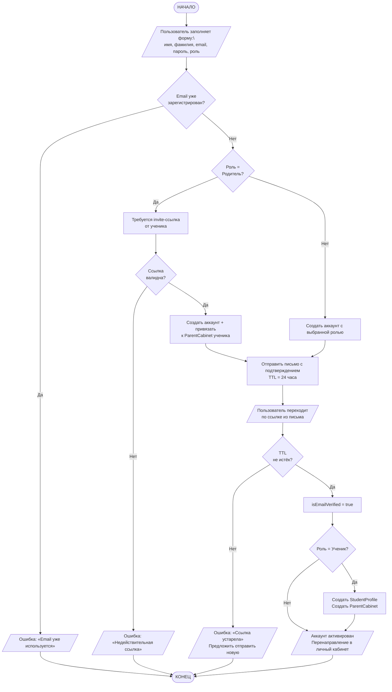
```mermaid
flowchart TD
    A([НАЧАЛО]) --> B[/Пользователь заполняет форму:\\nимя, фамилия, email, пароль, роль/]
    B --> C{Email уже\nзарегистрирован?}
    C -- Да --> D[/Ошибка: «Email уже используется»/]
    D --> Z([КОНЕЦ])
    C -- Нет --> E{Роль =\nРодитель?}
    E -- Да --> F[Требуется invite-ссылка\nот ученика]
    F --> G{Ссылка\nвалидна?}
    G -- Нет --> H[/Ошибка: «Недействительная ссылка»/]
    H --> Z
    G -- Да --> I[Создать аккаунт + привязать\nк ParentCabinet ученика]
    E -- Нет --> J[Создать аккаунт с выбранной ролью]
    I --> K[Отправить письмо с подтверждением\nTTL = 24 часа]
    J --> K
    K --> L[/Пользователь переходит\nпо ссылке из письма/]
    L --> M{TTL\nне истёк?}
    M -- Нет --> N[/Ошибка: «Ссылка устарела»\nПредложить отправить новую/]
    N --> Z
        M -- Да --> O[isEmailVerified = true]
    O --> O1{Роль = Ученик?}
    O1 -- Да --> O2[Создать StudentProfile\nСоздать ParentCabinet]
    O1 -- Нет --> P
    O2 --> P
    P[/Аккаунт активирован\nПеренаправление в личный кабинет/]
    P --> Z
```

#### Алгоритм 2: Вход и выдача JWT

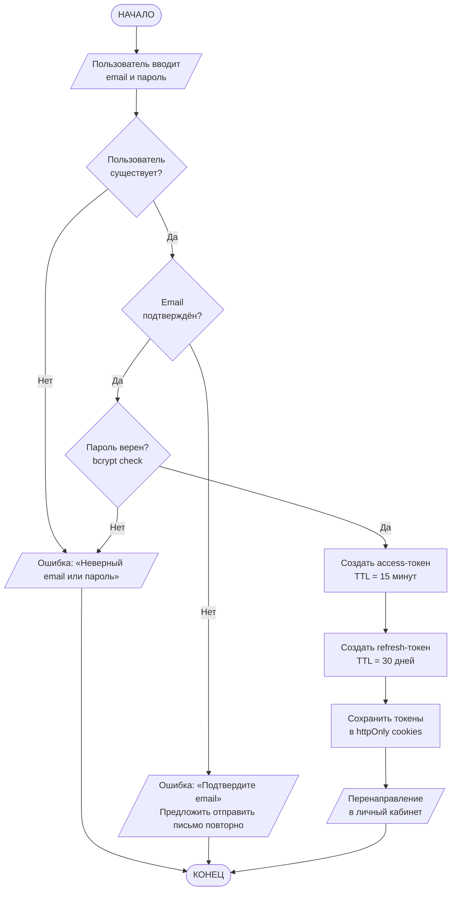
```mermaid
flowchart TD
    A([НАЧАЛО]) --> B[/Пользователь вводит\nemail и пароль/]
    B --> C{Пользователь\nсуществует?}
    C -- Нет --> D[/Ошибка: «Неверный email или пароль»/]
    D --> Z([КОНЕЦ])
    C -- Да --> E{Email\nподтверждён?}
    E -- Нет --> F[/Ошибка: «Подтвердите email»\nПредложить отправить письмо повторно/]
    F --> Z
    E -- Да --> G{Пароль верен?\nbcrypt check}
    G -- Нет --> D
    G -- Да --> H[Создать access-токен\nTTL = 15 минут]
    H --> I[Создать refresh-токен\nTTL = 30 дней]
    I --> J[Сохранить токены\nв httpOnly cookies]
    J --> K[/Перенаправление\nв личный кабинет/]
    K --> Z
```

#### Алгоритм 3: Обновление access-токена

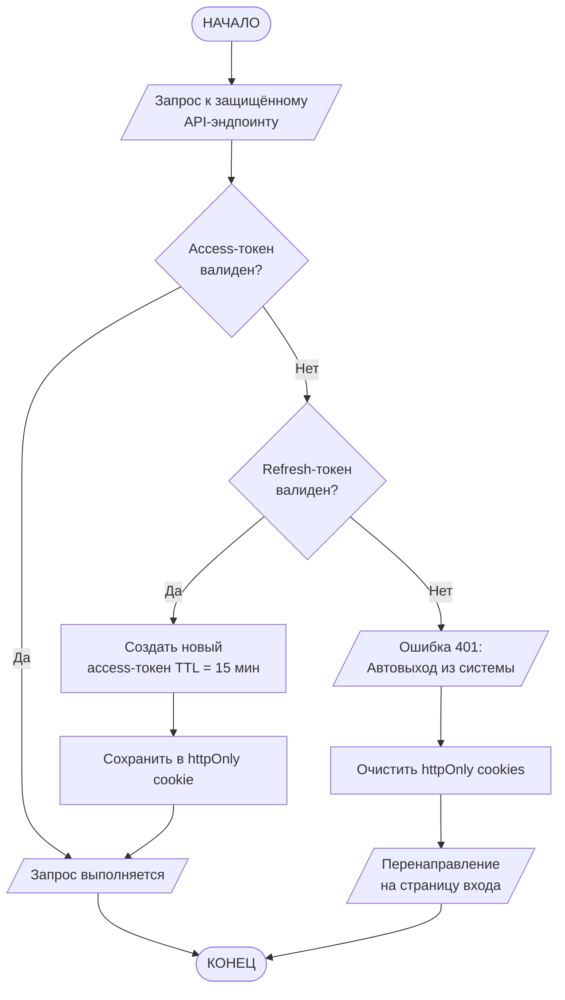
```mermaid
flowchart TD
    A([НАЧАЛО]) --> B[/Запрос к защищённому\nAPI-эндпоинту/]
    B --> C{Access-токен\nвалиден?}
    C -- Да --> D[/Запрос выполняется/]
    D --> Z([КОНЕЦ])
    C -- Нет --> E{Refresh-токен\nвалиден?}
    E -- Нет --> F[/Ошибка 401:\nАвтовыход из системы/]
    F --> G[Очистить httpOnly cookies]
    G --> H[/Перенаправление\nна страницу входа/]
    H --> Z
    E -- Да --> I[Создать новый\naccess-токен TTL = 15 мин]
    I --> J[Сохранить в httpOnly cookie]
    J --> D
```

#### Алгоритм 4: Сброс пароля

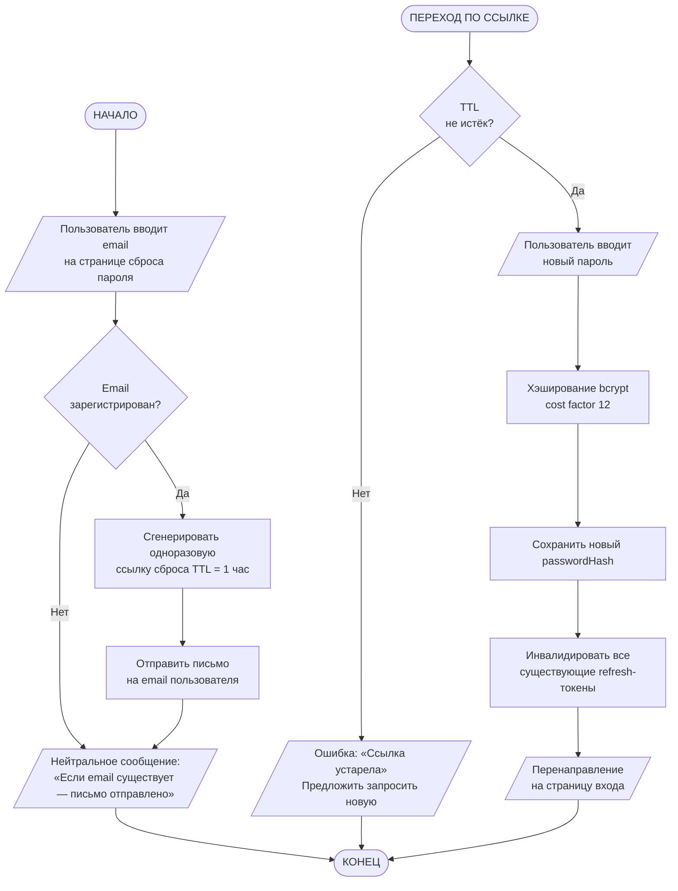
```mermaid
flowchart TD
    A([НАЧАЛО]) --> B[/Пользователь вводит email\nна странице сброса пароля/]
    B --> C{Email\nзарегистрирован?}
    C -- Нет --> D[/Нейтральное сообщение:\n«Если email существует — письмо отправлено»/]
    D --> Z([КОНЕЦ])
    C -- Да --> E[Сгенерировать одноразовую\nссылку сброса TTL = 1 час]
    E --> F[Отправить письмо\nна email пользователя]
    F --> D
    G([ПЕРЕХОД ПО ССЫЛКЕ]) --> H{TTL\nне истёк?}
    H -- Нет --> I[/Ошибка: «Ссылка устарела»\nПредложить запросить новую/]
    I --> Z
    H -- Да --> J[/Пользователь вводит\nновый пароль/]
    J --> K[Хэширование bcrypt\ncost factor 12]
    K --> L[Сохранить новый passwordHash]
    L --> M[Инвалидировать все\nсуществующие refresh-токены]
    M --> N[/Перенаправление\nна страницу входа/]
    N --> Z
```

***

## Модуль M2: LMS — Система обучения

### Зона ответственности
Курсы, уроки, тесты, прогресс учеников, онбординг.

### 5.2.0 Онбординг

После первой авторизации ученик видит приветственный экран с тремя шагами-подсказками:

| Шаг | Заголовок | Действие |
|---|---|---|
| 1 | Присоединись к классу | Ввести invite-код класса (выдаётся учителем) |
| 2 | Пройди первый урок | Открыть назначенный курс и начать Урок 1 |
| 3 | Создай свой первый проект | Перейти в AI IDE и выбрать шаблон |

- Онбординг-виджет отображается в кабинете ученика до тех пор, пока все три шага не выполнены
- Каждый выполненный шаг отмечается галочкой
- Ученик может скрыть онбординг вручную в любой момент
- Учитель видит в аналитике, на каком шаге онбординга находятся ученики

Для учителя при первом входе — отдельный онбординг из двух шагов: «Создай класс» → «Назначь курс».

### 5.2.1 Типы курсов

**Системные курсы:**
- Создаются администратором платформы
- Доступны любому учителю для форка и назначения своему классу
- Редактируются только через форк (оригинал защищён)
- Форкнутый курс помечен «На основе: [название оригинала]»

**Авторские курсы:**
- Создаются учителем
- Видны только классам этого учителя
- Полное редактирование без ограничений

**Структура:** Курс → Модуль → Урок

### 5.2.2 Редактор курсов для учителя

- Создание курса: название, описание, обложка
- Добавление модулей и уроков, изменение порядка (drag-sort)
- Редактор урока:
  - Загрузка видео (Selectel Object Storage)
  - Текстовый контент через **WYSIWYG-редактор TipTap**: заголовки H2/H3, жирный, курсив, списки, вставка кода с подсветкой, таблицы, изображения, ссылки
  - Привязка теста к уроку
- Назначение курса одному или нескольким классам
- Предпросмотр курса (кнопка «Просмотреть как ученик»): учитель видит уроки, видео, тексты и тесты в том же интерфейсе, что и ученик; прогресс и результаты тестов при этом не фиксируются

### 5.2.3 Системные курсы платформы

В MVP платформа содержит **один системный курс**, созданный администратором. В дальнейшем библиотека системных курсов будет расширяться.

При создании нового класса учителю автоматически предлагается форкнуть доступные системные курсы — через баннер или модальное окно «Рекомендуемые курсы для нового класса».

#### Курс «Нейросети для IT-проектов: начало»

**Для кого:** школьники без практического опыта работы с нейросетями.
**Цель:** познакомить с возможностями и ограничениями нейросетевых технологий, научить формулировать задачи для ИИ и безопасно использовать результаты в прикладных проектах.
**Структура:** 5 уроков, общая длительность материалов — **225 минут**.

| № | Урок | Краткое описание | Навыки и компетенции | Формат |
|---|---|---|---|---|
| 1 | Что такое нейросети и где они помогают в проектах | Принципы работы нейросетей, реальные кейсы | Выделение задач, границы применимости | Видео + текст + тест |
| 2 | Безопасность, этика и проверка фактов | Конфиденциальность, авторское право, фейки | Цифровая гигиена и правовая грамотность | Видео + текст + тест |
| 3 | Искусство написания запросов | Разбивка задач, шаблоны промтов | Создание эффективных промтов | Видео + текст + тест |
| 4 | Текст и идеи: от темы к структуре и контенту | Генерация идей, описаний, сценариев с ИИ | Генерация и верификация текстов | Видео + текст + тест |
| 5 | Создание ТЗ продукта | Итоговое задание — ТЗ на свой IT-проект | Формирование требований к проекту | Видео + текст + тест |

**Итоговый результат:** учащийся самостоятельно составляет ТЗ на собственный IT-проект с описанием идеи, целей и ожидаемых результатов.

**Ожидаемые результаты освоения курса:**
- определять, когда использование нейросетей целесообразно;
- корректно формулировать промты для разных нейросетевых сервисов;
- проверять достоверность и корректность сгенерированного контента;
- соблюдать принципы безопасности при работе с персональными данными;
- самостоятельно разрабатывать ТЗ для первого проекта на базе нейросети.

### 5.2.4 Настройки класса

| Настройка | По умолчанию | Описание |
|---|---|---|
| Рекомендовать системные курсы при создании класса | ВКЛ | Баннер с предложением форкнуть системные курсы |
| Доступные курсы | Все назначенные | Учитель управляет видимостью курсов для класса |

### 5.2.5 Тесты и прогресс

- Типы вопросов: одиночный выбор (radio), множественный выбор (checkbox)
- Проходной балл: **70% по умолчанию**; учитель может изменить при создании теста (диапазон 50–100%)
- Неограниченные попытки
- После завершения: правильные ответы с пояснениями
- Фиксируется: балл, количество попыток, дата последней попытки
- Прогресс: % завершения на уровне курса/модуля/урока
- Следующий урок открывается только после завершения текущего

### Блок-схемы алгоритмов M2

#### Алгоритм 1: Форк и назначение курса классу

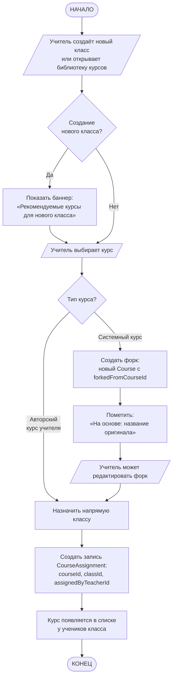
```mermaid
flowchart TD
    A([НАЧАЛО]) --> B[/Учитель создаёт новый класс\nили открывает библиотеку курсов/]
    B --> C{Создание\nнового класса?}
    C -- Да --> D[Показать баннер:\n«Рекомендуемые курсы для нового класса»]
    D --> E[/Учитель выбирает курс/]
    C -- Нет --> E
    E --> F{Тип курса?}
    F -- Авторский\nкурс учителя --> G[Назначить напрямую классу]
    F -- Системный курс --> H[Создать форк:\nновый Course с forkedFromCourseId]
    H --> I[Пометить:\n«На основе: название оригинала»]
    I --> J[/Учитель может редактировать форк/]
    J --> G
    G --> K[Создать запись CourseAssignment:\ncourseId, classId, assignedByTeacherId]
    K --> L[Курс появляется в списке\nу учеников класса]
    L --> Z([КОНЕЦ])
```

#### Алгоритм 2: Прохождение урока и обновление прогресса

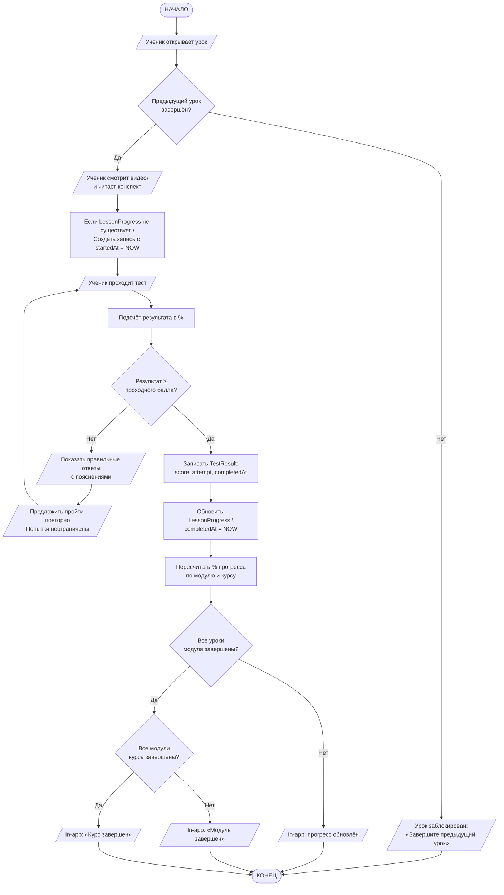
```mermaid
flowchart TD
    A([НАЧАЛО]) --> B[/Ученик открывает урок/]
    B --> C{Предыдущий урок\nзавершён?}
    C -- Нет --> D[/Урок заблокирован:\n«Завершите предыдущий урок»/]
    D --> Z([КОНЕЦ])
    C -- Да --> E[/Ученик смотрит видео\\nи читает конспект/]
    E --> E1[Если LessonProgress не существует:\\nСоздать запись с startedAt = NOW]
    E1 --> H[/Ученик проходит тест/]
    H --> I[Подсчёт результата в %]
    I --> J{Результат ≥\nпроходного балла?}
    J -- Нет --> K[/Показать правильные ответы\nс пояснениями/]
    K --> L[/Предложить пройти повторно\nПопытки неограничены/]
    L --> H
    J -- Да --> M[Записать TestResult:\nscore, attempt, completedAt]
    M --> N[Обновить LessonProgress:\\ncompletedAt = NOW]
    N --> O[Пересчитать % прогресса\nпо модулю и курсу]
    O --> P{Все уроки\nмодуля завершены?}
    P -- Нет --> Q[/In-app: прогресс обновлён/]
    Q --> Z
    P -- Да --> R{Все модули\nкурса завершены?}
    R -- Нет --> S[/In-app: «Модуль завершён»/]
    S --> Z
    R -- Да --> T[/In-app: «Курс завершён»/]
    T --> Z
```

#### Алгоритм 3: Прохождение теста

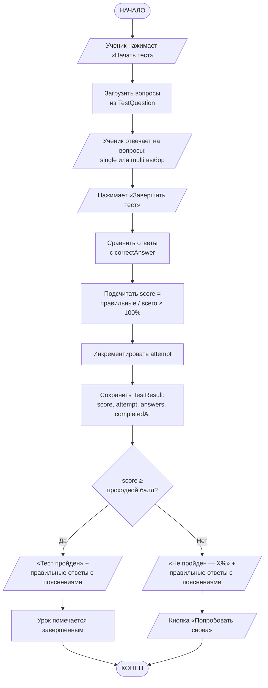
```mermaid
flowchart TD
    A([НАЧАЛО]) --> B[/Ученик нажимает «Начать тест»/]
    B --> C[Загрузить вопросы\nиз TestQuestion]
    C --> D[/Ученик отвечает на вопросы:\nsingle или multi выбор/]
    D --> E[/Нажимает «Завершить тест»/]
    E --> F[Сравнить ответы\nс correctAnswer]
    F --> G[Подсчитать score =\nправильные / всего × 100%]
    G --> H[Инкрементировать attempt]
    H --> I[Сохранить TestResult:\nscore, attempt, answers, completedAt]
    I --> J{score ≥\nпроходной балл?}
    J -- Да --> K[/«Тест пройден» +\nправильные ответы с пояснениями/]
    K --> L[Урок помечается завершённым]
    L --> Z([КОНЕЦ])
    J -- Нет --> M[/«Не пройден — X%» +\nправильные ответы с пояснениями/]
    M --> N[/Кнопка «Попробовать снова»/]
    N --> Z
```

***

## Модуль M3: AI IDE — ИИ-среда создания проектов

### Зона ответственности
Интерактивная среда диалога с ИИ, генерация Python-кода, версионирование, управление шаблонами проектов и промтов.

### 5.3.1 Интерфейс

- **Вверху:** поле ввода промта + селектор модели
- **Слева/по центру:** история диалога с ИИ (чат-интерфейс)
- **Справа:** кодовый редактор (полностью редактируемый) — ИИ выводит сюда результат, ученик может вносить правки вручную в любой момент
- Ответ ИИ выводится **посимвольно** в реальном времени (SSE/streaming)
- Блок кода начинает подсвечивать синтаксис после завершения блока (не посимвольно, чтобы избежать мерцания)
- Кнопка **«Стоп»** — прерывает генерацию с сохранением полученного фрагмента

**Кнопки управления:**
- «Сгенерировать» — отправить промт ИИ
- «Применить код» — сохранить текущее содержимое редактора как новую версию (активна после завершения генерации ИИ **или** после ручного редактирования кода)
- «Запустить» — выполнить код в Python-sandbox
- «Откатить» — выбрать одну из последних 10 версий кода

### 5.3.2 Шаблоны проектов (минимум 5 в MVP)

| # | Шаблон | Описание |
|---|---|---|
| 1 | Чат-ассистент | Диалог с LLM по заданной теме |
| 2 | Генератор текста | Генерация текста по шаблону с переменными |
| 3 | Классификатор/анализатор | Определение тональности, категории |
| 4 | Q&A по тексту | Ответы на вопросы по загруженному тексту |
| 5 | Telegram-бот (симуляция) | Симуляция диалога с ботом внутри платформы |

Каждый шаблон содержит: системный промт, стартовый код-заготовку, описание, теги.

**Telegram-бот — Режим B (Симуляция):**
- Встроенный текстовый интерфейс «вопрос → ответ бота» без выхода в Telegram
- Помечен «⚠️ Режим симуляции — бот работает внутри платформы»
- Пояснение: «Подключение реального Telegram-бота будет доступно в следующей версии платформы»

> **Примечание:** Режим A (реальный бот в Telegram с токеном @BotFather) не входит в MVP — требует постоянного сетевого соединения, несовместим с архитектурой sandbox (тайм-аут 30 сек, закрытая внешняя сеть).

### 5.3.3 Библиотека промт-шаблонов

Отдельная от шаблонов проектов библиотека готовых промтов для быстрого старта в AI IDE.

**Назначение:** ученик может выбрать готовый промт из библиотеки, вставить его в поле ввода одним кликом и отредактировать под свою задачу.

**Категории промтов (MVP — минимум 15 шаблонов):**

| Категория | Примеры промтов |
|---|---|
| Генерация кода | «Напиши функцию на Python, которая…», «Создай класс для…» |
| Отладка | «Найди ошибку в этом коде и объясни её», «Почему код выдаёт ошибку…» |
| Объяснение | «Объясни этот код простыми словами», «Что делает эта функция?» |
| Улучшение | «Сделай код чище и добавь комментарии», «Оптимизируй функцию…» |
| Идеи проектов | «Предложи 5 идей для чат-бота на тему…», «Какие функции можно добавить в…» |

**Структура промт-шаблона:**
- Название (до 60 символов)
- Категория
- Текст промта с плейсхолдерами `{{тема}}`, `{{язык}}`, `{{описание}}`
- Теги

**Управление:** промт-шаблоны создаются администратором платформы. Ученики не могут редактировать системные шаблоны, но могут сохранять свои избранные.

**Избранные промты:**
- Рядом с каждым промт-шаблоном отображается кнопка ⭐
- Нажатие на ⭐ добавляет промт в избранное текущего ученика; повторное нажатие — удаляет
- Избранные промты отображаются в отдельной вкладке «Мои избранные» внутри библиотеки промтов (вкладка видна только если в избранном есть хотя бы один промт)
- Вставка промта в поле ввода AI IDE работает одинаково как из общего списка, так и из вкладки «Мои избранные»
- Максимум **50 промтов** в избранном на одного ученика; при превышении показывается предупреждение «Достигнут лимит избранного — удалите ненужные, чтобы добавить новые»
- Если системный промт-шаблон удалён администратором, он автоматически исчезает из избранного всех учеников


### 5.3.4 Версионирование кода

- ИИ генерирует **только Python-код**
- Хранятся последние **10 версий** кода с датой и кратким описанием
- Кнопка «Откатить» к любой из сохранённых версий
- При «Применить код» — создаётся новая версия

### 5.3.5 Блок-схемы алгоритмов M3

#### Алгоритм 1: Генерация кода

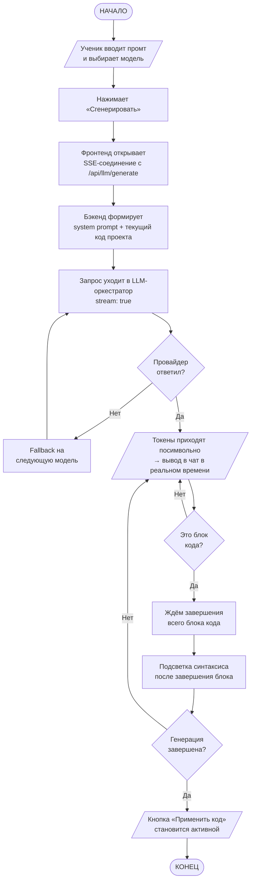
```mermaid
flowchart TD
    A([НАЧАЛО]) --> B[/Ученик вводит промт\nи выбирает модель/]
    B --> C[Нажимает «Сгенерировать»]
    C --> D[Фронтенд открывает\nSSE-соединение с /api/llm/generate]
    D --> E[Бэкенд формирует\nsystem prompt + текущий код проекта]
    E --> F[Запрос уходит в LLM-оркестратор\nstream: true]
    F --> G{Провайдер\nответил?}
    G -- Нет --> H[Fallback на\nследующую модель]
    H --> F
    G -- Да --> I[/Токены приходят посимвольно\n→ вывод в чат в реальном времени/]
    I --> J{Это блок\nкода?}
    J -- Нет --> I
    J -- Да --> K[Ждём завершения\nвсего блока кода]
    K --> L[Подсветка синтаксиса\nпосле завершения блока]
    L --> M{Генерация\nзавершена?}
    M -- Нет --> I
    M -- Да --> N[/Кнопка «Применить код»\nстановится активной/]
    N --> O([КОНЕЦ])
```

#### Алгоритм 2: Создание версий кода

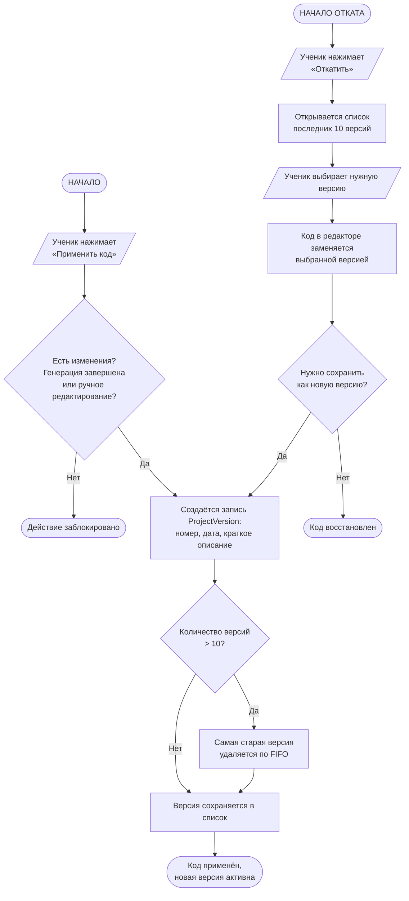
```mermaid
flowchart TD
    A([НАЧАЛО]) --> B[/Ученик нажимает\n«Применить код»/]
    B --> C{Есть изменения?\nГенерация завершена\nили ручное редактирование?}
    C -- Нет --> Z([Действие заблокировано])
    C -- Да --> D[Создаётся запись ProjectVersion:\nномер, дата, краткое описание]
    D --> E{Количество версий\n> 10?}
    E -- Нет --> F[Версия сохраняется в список]
    E -- Да --> G[Самая старая версия\nудаляется по FIFO]
    G --> F
    F --> H([Код применён,\nновая версия активна])

    I([НАЧАЛО ОТКАТА]) --> J[/Ученик нажимает\n«Откатить»/]
    J --> K[Открывается список\nпоследних 10 версий]
    K --> L[/Ученик выбирает нужную версию/]
    L --> M[Код в редакторе заменяется\nвыбранной версией]
    M --> N{Нужно сохранить\nкак новую версию?}
    N -- Да --> D
    N -- Нет --> O([Код восстановлен])
```

#### Алгоритм 3: Прерывание генерации («Стоп»)

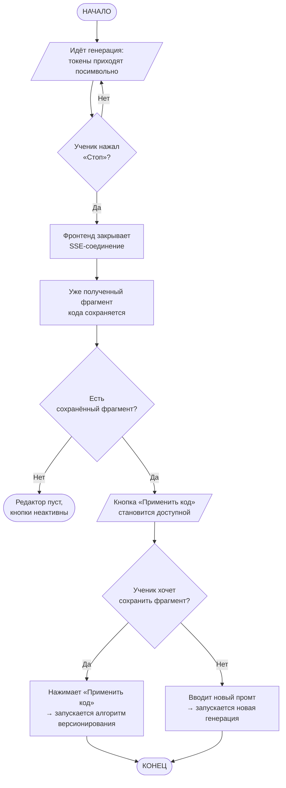
```mermaid
flowchart TD
    A([НАЧАЛО]) --> B[/Идёт генерация:\nтокены приходят посимвольно/]
    B --> C{Ученик нажал\n«Стоп»?}
    C -- Нет --> B
    C -- Да --> D[Фронтенд закрывает\nSSE-соединение]
    D --> E[Уже полученный фрагмент\nкода сохраняется]
    E --> F{Есть\nсохранённый фрагмент?}
    F -- Нет --> G([Редактор пуст,\nкнопки неактивны])
    F -- Да --> H[/Кнопка «Применить код»\nстановится доступной/]
    H --> I{Ученик хочет\nсохранить фрагмент?}
    I -- Да --> J[Нажимает «Применить код»\n→ запускается алгоритм версионирования]
    I -- Нет --> K[Вводит новый промт\n→ запускается новая генерация]
    J --> Z([КОНЕЦ])
    K --> Z
```

***

## Модуль M4: Python-sandbox

### Зона ответственности
Изолированное выполнение Python-кода, управление пакетами, контроль суточных лимитов, проксирование LLM-вызовов из кода ученика.

### 5.4.1 Среда выполнения

- Изолированный контейнер под каждый запуск
- Python **3.11**
- Без доступа к файловой системе хоста
- Без произвольных сетевых запросов (только через LLM-прокси платформы — `http://litellm:4000`)
- Все исходящие TCP-соединения, кроме адреса LLM-прокси, блокируются на уровне Docker-сети

### 5.4.2 Белый список pip-пакетов

Пакеты указываются в первой строке кода через специальный комментарий:

```python
# pip: openai pandas numpy
```

**Разрешённые пакеты (MVP):**

| Категория      | Пакеты                          |
| -------------- | ------------------------------- |
| Данные         | pandas, numpy                   |
| Утилиты        | python-dotenv, pydantic, loguru |
| Форматирование | rich, tabulate                  |

**Запрещены в MVP:** `requests`, `httpx`, `beautifulsoup4`, `python-telegram-bot`, `langchain-core` (транзитивно устанавливает запрещённый `httpx`) и любые пакеты с прямым доступом к сети, ОС, шифрованием, майнингом.


> **После MVP:** будет добавлена категория «HTTP и парсинг» (`requests`, `httpx`, `beautifulsoup4`), категория «Telegram-боты» (`python-telegram-bot`) и категория «LangChain» (`langchain-core` и производные) — после реализации проверки транзитивных зависимостей при установке пакетов.


### 5.4.3 Лимиты по времени работы (в день)

- Лёгкий проект (консольные, Q&A): до **2 часов** суммарно
- Сложный проект (LLM-чейны, симуляция ботов): до **30 минут** суммарно

Дополнительные ограничения:
- Тайм-аут одного запроса: 30 секунд
- RAM на контейнер: 256 МБ

### 5.4.4 Доступ к проектам

- Сам ученик — полный доступ (код + запуск)
- Учитель класса — просмотр кода + запуск
- Родительский кабинет — только запуск (без кода)

Публичных URL не существует в MVP.

### 5.4.5 Результат запуска

- Консольный вывод — в отдельной панели рядом с редактором
- HTML-вывод — рендер во встроенном iframe

### 5.4.6 Блок-схемы алгоритмов M4

#### Алгоритм 1: Запуск кода

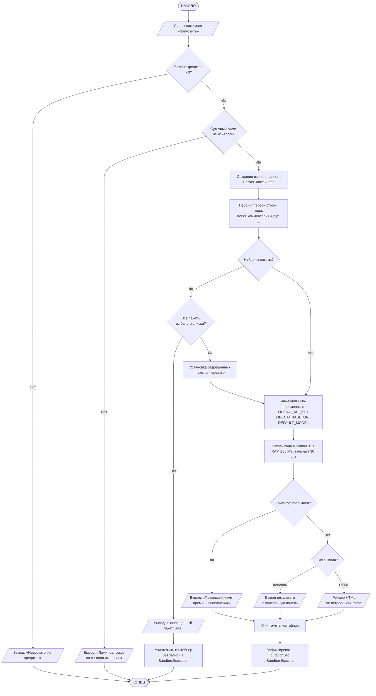
```mermaid
flowchart TD
    A([НАЧАЛО]) --> B[/Ученик нажимает «Запустить»/]
    B --> C{Баланс кредитов\n> 0?}
    C -- Нет --> D[/Вывод: «Недостаточно кредитов»/]
    D --> Z([КОНЕЦ])
    C -- Да --> E{Суточный лимит\nне исчерпан?}
    E -- Нет --> F[/Вывод: «Лимит запусков\nна сегодня исчерпан»/]
    F --> Z
    E -- Да --> G[Создание изолированного\nDocker-контейнера]
    G --> H[Парсинг первой строки кода:\nпоиск комментария # pip: ...]
    H --> I{Найдены пакеты?}
    I -- Да --> J{Все пакеты\nиз белого списка?}
    J -- Нет --> K[/Вывод: «Запрещённый пакет: имя»/]
    K --> LPRE[Уничтожить контейнер\nбез записи в SandboxExecution]
    LPRE --> Z
    J -- Да --> M[Установка разрешённых\nпакетов через pip]
    I -- Нет --> N[Инжекция ENV-переменных:\nOPENAI_API_KEY\nOPENAI_BASE_URL\nDEFAULT_MODEL]
    M --> N
    N --> O[Запуск кода в Python 3.11\nRAM 256 МБ, тайм-аут 30 сек]
    O --> P{Тайм-аут превышен?}
    P -- Да --> Q[/Вывод: «Превышен лимит\nвремени выполнения»/]
    Q --> L
    P -- Нет --> R{Тип вывода?}
    R -- Консоль --> S[/Вывод результата\nв консольную панель/]
    R -- HTML --> T[/Рендер HTML\nво встроенном iframe/]
    S --> L
    T --> L
    L[Уничтожить контейнер] --> U[Зафиксировать durationSec\nв SandboxExecution]
    U --> Z
```

#### Алгоритм 2: Суточный лимит по времени работы

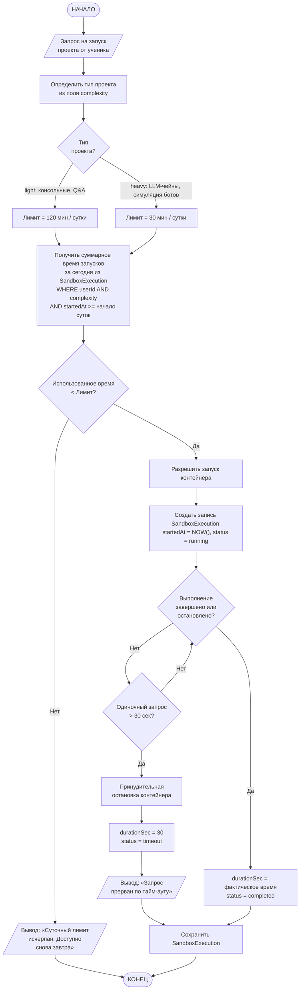
```mermaid
flowchart TD
    A([НАЧАЛО]) --> B[/"Запрос на запуск<br/>проекта от ученика"/]
    B --> C["Определить тип проекта<br/>из поля complexity"]
    C --> D{"Тип<br/>проекта?"}
    D -- "light: консольные, Q&A" --> E[Лимит = 120 мин / сутки]
    D -- "heavy: LLM-чейны, симуляция ботов" --> F[Лимит = 30 мин / сутки]
    E --> G["Получить суммарное время запусков<br/>за сегодня из SandboxExecution<br/>WHERE userId AND complexity<br/>AND startedAt >= начало суток"]
    F --> G
    G --> H{"Использованное время<br/>< Лимит?"}
    H -- Нет --> I[/"Вывод: «Суточный лимит<br/>исчерпан. Доступно<br/>снова завтра»"/]
    I --> Z([КОНЕЦ])
    H -- Да --> J[Разрешить запуск контейнера]
    J --> K["Создать запись SandboxExecution:<br/>startedAt = NOW(), status = running"]
    K --> L{"Выполнение<br/>завершено или<br/>остановлено?"}
    L -- Нет --> M{"Одиночный запрос<br/>> 30 сек?"}
    M -- Нет --> L
    M -- Да --> N["Принудительная<br/>остановка контейнера"]
    N --> O["durationSec = 30<br/>status = timeout"]
    O --> P[/"Вывод: «Запрос<br/>прерван по тайм-ауту»"/]
    P --> Q[Сохранить SandboxExecution]
    Q --> Z
    L -- Да --> R["durationSec = фактическое время<br/>status = completed"]
    R --> Q
```

#### Алгоритм 3: LLM-вызовы из sandbox

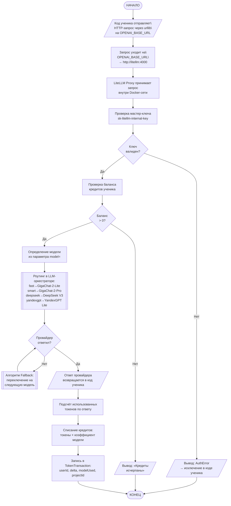
```mermaid
flowchart TD
    A([НАЧАЛО]) --> B[/Код ученика отправляет\\nHTTP-запрос через urllib\\nна OPENAI_BASE_URL/]
    B --> C[Запрос уходит на\\nOPENAI_BASE_URL\\n→ http://litellm:4000]
    C --> D[LiteLLM Proxy принимает запрос\nвнутри Docker-сети]
    D --> E[Проверка мастер-ключа\nsk-litellm-internal-key]
    E --> F{Ключ\nвалиден?}
    F -- Нет --> G[/Вывод: AuthError\n→ исключение в коде ученика/]
    G --> Z([КОНЕЦ])
    F -- Да --> H[Проверка баланса\nкредитов ученика]
    H --> I{Баланс\n> 0?}
    I -- Нет --> J[/Вывод: «Кредиты\nисчерпаны»/]
    J --> Z
    I -- Да --> K[Определение модели\nиз параметра model=]
    K --> L[[Роутинг в LLM-оркестраторе:\nfast→GigaChat-2-Lite\nsmart→GigaChat-2-Pro\ndeepseek→DeepSeek V3\nyandexgpt→YandexGPT Lite]]
    L --> M{Провайдер\nответил?}
    M -- Нет --> N[[Алгоритм Fallback:\nпереключение на\nследующую модель]]
    N --> M
    M -- Да --> O[/Ответ провайдера\nвозвращается в код ученика/]
    O --> P[Подсчёт использованных\nтокенов по ответу]
    P --> Q[Списание кредитов:\nтокены × коэффициент модели]
    Q --> R[Запись в TokenTransaction:\nuserId, delta, modelUsed, projectId]
    R --> Z
```

***

## Модуль M5: LLM-оркестратор

### Зона ответственности
Единый слой маршрутизации всех LLM-запросов платформы, управление провайдерами, кэширование, контроль бюджета.

### 5.5.1 Принципиальные решения

- Используются **только российские LLM** и провайдеры с серверами в РФ
- Зарубежные провайдеры не используются (невозможность легальной оплаты из РФ)
- Все LLM-вызовы проходят через **единый LLM-оркестратор и прокси**
- Ученик **никогда не видит** API-ключи и технические детали
- Токены/кредиты тратятся на: генерацию кода ИИ + LLM-вызовы из sandbox

### 5.5.2 Российские модели

| Отображение в UI | Провайдер | API-модель | Назначение |
|---|---|---|---|
| ⚡ Быстрая | Сбер | `GigaChat-2-Lite` | Быстрые итерации, простые задачи |
| 🧠 Умная | Сбер | `GigaChat-2-Pro` | Сложный и чистый Python-код |
| 🔵 YandexGPT | Яндекс | `yandexgpt-lite` | Объяснения, тексты на русском |
| 🐋 DeepSeek | Timeweb Cloud (РФ) | `deepseek-v3` | Лучшее качество кода |

**Дефолтная модель для генерации кода: DeepSeek V3**
**Дефолтная модель для runtime в sandbox: GigaChat-2-Lite**

### 5.5.3 Актуальные тарифы (март 2026)

| Модель | ₽ / 1К токенов | ₽ / сессию (~2 500 токенов) | Качество кода |
|---|---|---|---|
| GigaChat-2-Lite | 0.022 ₽ | **0.06 ₽** | ⭐⭐⭐ |
| DeepSeek V3 | 0.072 ₽ | **0.18 ₽** | ⭐⭐⭐⭐⭐ |
| GigaChat-2-Pro | 0.167 ₽ | **0.42 ₽** | ⭐⭐⭐⭐ |
| YandexGPT Lite | 0.200 ₽ | **0.50 ₽** | ⭐⭐⭐ |

> **После MVP:** YandexGPT Pro (1.200 ₽ / 1К токенов, ⭐⭐⭐⭐) — планируется к подключению при появлении необходимости в более высоком качестве русскоязычных текстов.

### 5.5.4 Архитектура LLM-слоя

```
[Браузер ученика]
   Промт + модель → /api/llm/generate (SSE)
         ↓
[LLM Orchestrator Service — Node.js]
   1. Проверка JWT и баланса токенов
   2. Формирование system prompt + текущий код
   3. Подсчёт предполагаемых токенов
   4. Запрос в LiteLLM Proxy (stream: true)
   5. SSE-поток → клиент
   6. По завершении: списание токенов, сохранение версии
         ↓
[LiteLLM Proxy — Docker-контейнер]
   OpenAI-совместимый API
   Роутинг по имени модели:
     fast      → GigaChat-2-Lite (Сбер)
     smart     → GigaChat-2-Pro (Сбер)
     yandexgpt → YandexGPT Lite (Яндекс)
     deepseek  → DeepSeek V3 (Timeweb)
   Управление OAuth2 токенами GigaChat (авто-refresh)
   Управление IAM-токенами YandexGPT (авто-refresh)
   Fallback при сбоях (каскадный):
     deepseek → smart → fast → yandexgpt
   Если все модели недоступны → «Сервис временно недоступен»
         ↓
[Провайдеры: GigaChat / YandexGPT / DeepSeek@Timeweb]
```

### 5.5.5 Алгоритм подключения провайдеров

**GigaChat (Сбер):**
1. Регистрация на `developers.sber.ru` через SberID
2. Создание проекта → получение `Client ID` + `Client Secret`
3. Формирование `Authorization Key = Base64(clientId:clientSecret)`
4. Запись в `.env`: `GIGACHAT_CREDENTIALS=<base64>`
5. OAuth2-токены живут 30 минут → LiteLLM делает авто-refresh
6. Добавить сертификат Минцифры РФ в Docker-контейнер (SSL)

**YandexGPT (Яндекс):**
1. Регистрация на `console.yandex.cloud`
2. Создать Folder → создать Service Account с ролью `ai.languageModels.user`
3. Создать API-ключ для Service Account
4. Запись в `.env`: `YANDEX_API_KEY=...`, `YANDEX_FOLDER_ID=b1g...`
5. IAM-токены живут 12 часов → LiteLLM делает авто-refresh

**DeepSeek через Timeweb Cloud:**
1. Регистрация на `timeweb.cloud`
2. Подключить услугу «AI API» → получить API-ключ
3. Endpoint: `https://llm.timeweb.cloud/v1` (OpenAI-совместимый)
4. Запись в `.env`: `TIMEWEB_API_KEY=...`

### 5.5.6 Sandbox: переменные окружения

```python
import urllib.request, json, os

data = json.dumps({
    "model": "fast",  # → LiteLLM направит в GigaChat-2-Lite
    "messages": [{"role": "user", "content": prompt}]
}).encode()

req = urllib.request.Request(
    os.environ["OPENAI_BASE_URL"] + "/v1/chat/completions",
    data=data,
    headers={
        "Authorization": "Bearer " + os.environ["OPENAI_API_KEY"],
        "Content-Type": "application/json"
    }
)
result = json.loads(urllib.request.urlopen(req).read())
answer = result["choices"]["message"]["content"]
```

Переменные, которые sandbox получает при запуске:
```bash
OPENAI_API_KEY=sk-litellm-internal-key
OPENAI_BASE_URL=http://litellm:4000
DEFAULT_MODEL=fast
```

### 5.5.7 LiteLLM конфигурация

```yaml
model_list:
  - model_name: fast
    litellm_params:
      model: gigachat/GigaChat-2-Lite
      api_key: os.environ/GIGACHAT_CREDENTIALS

  - model_name: smart
    litellm_params:
      model: gigachat/GigaChat-2-Pro
      api_key: os.environ/GIGACHAT_CREDENTIALS

  - model_name: deepseek
    litellm_params:
      model: openai/deepseek-v3
      api_key: os.environ/TIMEWEB_API_KEY
      api_base: https://llm.timeweb.cloud/v1

  - model_name: yandexgpt
    litellm_params:
      model: yandex/yandexgpt-lite
      api_key: os.environ/YANDEX_API_KEY
      extra_headers:
        x-folder-id: os.environ/YANDEX_FOLDER_ID

router_settings:
  fallbacks:
    - {"deepseek": ["smart"]}
    - {"smart": ["fast"]}
    - {"fast": ["yandexgpt"]}
  num_retries: 2
  retry_after: 5

litellm_settings:
  max_budget: 5000
  budget_duration: "1mo"

cache:
  type: redis
  host: redis
  port: 6379
  ttl: 3600
```

### 5.5.8 Операционные расходы на LLM (500 учеников/мес)

| Модель | Доля | Токены | Стоимость |
|---|---|---|---|
| DeepSeek V3 | 50% | 12.5M | **900 ₽** |
| GigaChat-2-Lite | 30% | 7.5M | **165 ₽** |
| GigaChat-2-Pro | 15% | 3.75M | **626 ₽** |
| YandexGPT Lite | 5% | 1.25M | **250 ₽** |
| Runtime sandbox (GigaChat-2-Lite) | — | 9M | **198 ₽** |
| **Итого** | | **34M** | **≈ 2 139 ₽/мес** |

### 5.5.9 Блок-схемы алгоритмов M5

#### Алгоритм 1: Основной алгоритм обработки запроса

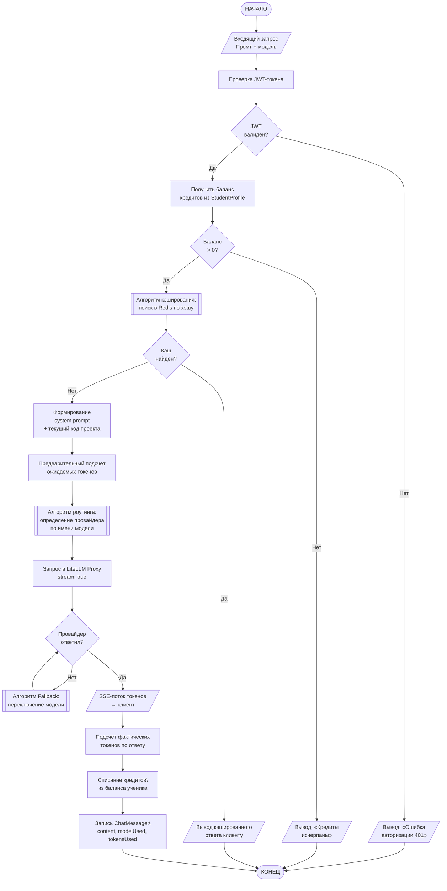
```mermaid
flowchart TD
    A([НАЧАЛО]) --> B[/Входящий запрос\nПромт + модель/]
    B --> C[Проверка JWT-токена]
    C --> D{JWT\nвалиден?}
    D -- Нет --> E[/Вывод: «Ошибка\nавторизации 401»/]
    E --> Z([КОНЕЦ])
    D -- Да --> F[Получить баланс\nкредитов из StudentProfile]
    F --> G{Баланс\n> 0?}
    G -- Нет --> H[/Вывод: «Кредиты\nисчерпаны»/]
    H --> Z
    G -- Да --> I[[Алгоритм кэширования:\nпоиск в Redis по хэшу]]
    I --> J{Кэш\nнайден?}
    J -- Да --> K[/Вывод кэшированного\nответа клиенту/]
    K --> Z
    J -- Нет --> L[Формирование\nsystem prompt\n+ текущий код проекта]
    L --> M[Предварительный подсчёт\nожидаемых токенов]
    M --> N[[Алгоритм роутинга:\nопределение провайдера\nпо имени модели]]
    N --> O[Запрос в LiteLLM Proxy\nstream: true]
    O --> P{Провайдер\nответил?}
    P -- Нет --> Q[[Алгоритм Fallback:\nпереключение модели]]
    Q --> P
    P -- Да --> R[/SSE-поток токенов\n→ клиент/]
    R --> S[Подсчёт фактических\nтокенов по ответу]
    S --> T[Списание кредитов\\nиз баланса ученика]
    T --> U[Запись ChatMessage:\\ncontent, modelUsed, tokensUsed]
    U --> Z
```

#### Алгоритм 2: Роутинг по моделям

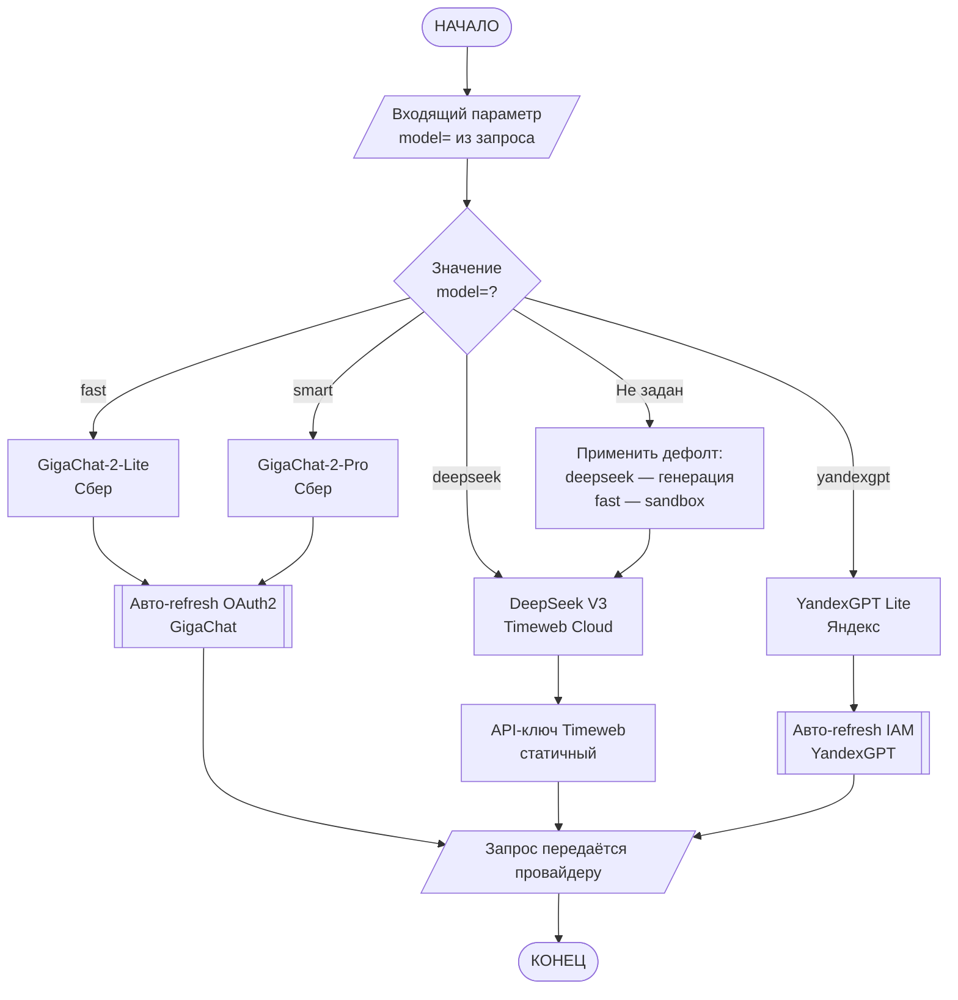
```mermaid
flowchart TD
    A([НАЧАЛО]) --> B[/Входящий параметр\nmodel= из запроса/]
    B --> C{Значение\nmodel=?}
    C -- fast --> D[GigaChat-2-Lite\nСбер]
    C -- smart --> E[GigaChat-2-Pro\nСбер]
    C -- deepseek --> F[DeepSeek V3\nTimeweb Cloud]
    C -- yandexgpt --> G[YandexGPT Lite\nЯндекс]
    C -- Не задан --> H[Применить дефолт:\ndeepseek — генерация\nfast — sandbox]
    H --> F
    D --> I[[Авто-refresh OAuth2\nGigaChat]]
    E --> I
    F --> J[API-ключ Timeweb\nстатичный]
    G --> K[[Авто-refresh IAM\nYandexGPT]]
    I --> L[/Запрос передаётся провайдеру/]
    J --> L
    K --> L
    L --> Z([КОНЕЦ])
```

#### Алгоритм 3: Fallback при сбоях

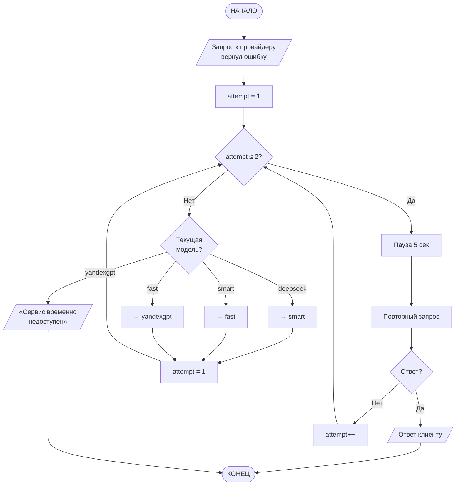
```mermaid
flowchart TD
    A([НАЧАЛО]) --> B[/Запрос к провайдеру\nвернул ошибку/]
    B --> C[attempt = 1]
    C --> D{attempt ≤ 2?}
    D -- Да --> E[Пауза 5 сек]
    E --> F[Повторный запрос]
    F --> G{Ответ?}
    G -- Да --> H[/Ответ клиенту/]
    H --> Z([КОНЕЦ])
    G -- Нет --> I[attempt++]
    I --> D
    D -- Нет --> J{Текущая\nмодель?}
    J -- deepseek --> K[→ smart]
    J -- smart --> L[→ fast]
    J -- fast --> M[→ yandexgpt]
    J -- yandexgpt --> N[/«Сервис временно\nнедоступен»/]
    N --> Z
    K --> O[attempt = 1]
    L --> O
    M --> O
    O --> D
```

#### Алгоритм 4: Авто-refresh токенов провайдеров

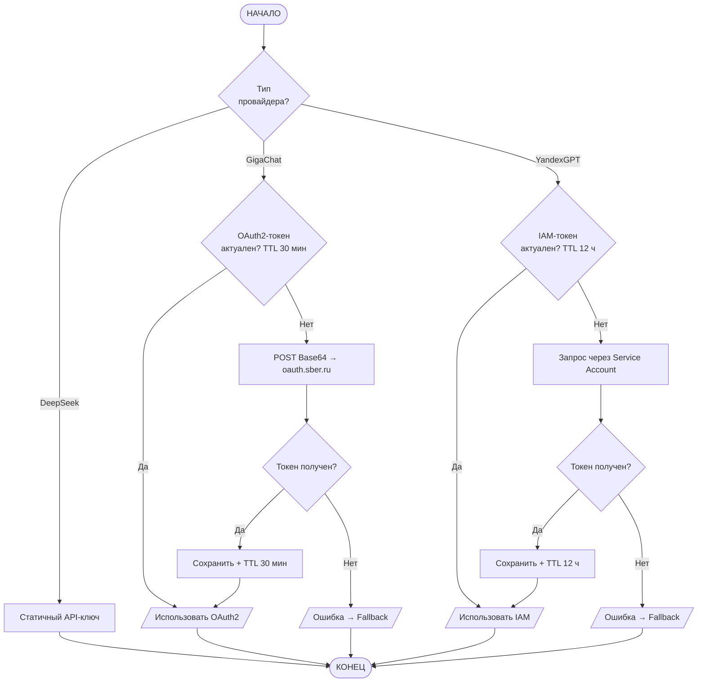
```mermaid
flowchart TD
    A([НАЧАЛО]) --> B{Тип\nпровайдера?}
    B -- GigaChat --> C{OAuth2-токен\nактуален? TTL 30 мин}
    B -- YandexGPT --> D{IAM-токен\nактуален? TTL 12 ч}
    B -- DeepSeek --> E[Статичный API-ключ]
    E --> Z([КОНЕЦ])
    C -- Да --> F[/Использовать OAuth2/]
    F --> Z
    C -- Нет --> G[POST Base64 → oauth.sber.ru]
    G --> H{Токен получен?}
    H -- Нет --> I[/Ошибка → Fallback/]
    I --> Z
    H -- Да --> J[Сохранить + TTL 30 мин]
    J --> F
    D -- Да --> K[/Использовать IAM/]
    K --> Z
    D -- Нет --> L[Запрос через Service Account]
    L --> M{Токен получен?}
    M -- Нет --> N[/Ошибка → Fallback/]
    N --> Z
    M -- Да --> O[Сохранить + TTL 12 ч]
    O --> K
```

#### Алгоритм 5: Кэширование ответов (Redis)

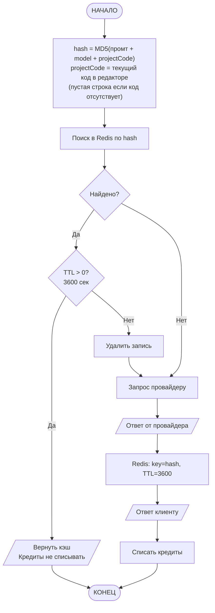
```mermaid
flowchart TD
    A([НАЧАЛО]) --> B["hash = MD5(промт + model + projectCode)\nprojectCode = текущий код в редакторе\n(пустая строка если код отсутствует)"]
    B --> C[Поиск в Redis по hash]
    C --> D{Найдено?}
    D -- Да --> E{TTL > 0?\n3600 сек}
    E -- Да --> F[/Вернуть кэш\nКредиты не списывать/]
    F --> Z([КОНЕЦ])
    E -- Нет --> G[Удалить запись]
    G --> H[Запрос провайдеру]
    D -- Нет --> H
    H --> I[/Ответ от провайдера/]
    I --> J[Redis: key=hash, TTL=3600]
    J --> K[/Ответ клиенту/]
    K --> L[Списать кредиты]
    L --> Z
```

#### Алгоритм 6: Аварийный стоп

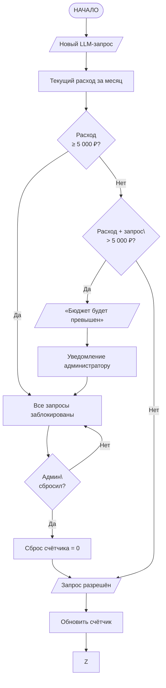
```mermaid
flowchart TD
    A([НАЧАЛО]) --> B[/Новый LLM-запрос/]
    B --> C[Текущий расход за месяц]
    C --> D{Расход\n≥ 5 000 ₽?}
    D -- Да --> E[Все запросы заблокированы]
    E --> F{Админ\\nсбросил?}
    F -- Нет --> E
    F -- Да --> G[Сброс счётчика = 0]
    G --> I
    D -- Нет --> H{Расход + запрос\\n> 5 000 ₽?}
    H -- Нет --> I[/Запрос разрешён/]
    I --> J[Обновить счётчик]
    J --> Z
    H -- Да --> K[/«Бюджет будет превышен»/]
    K --> L[Уведомление администратору]
    L --> E
```

***

## Модуль M6: Личные кабинеты

### Кабинет ученика
- Прогресс по курсам
- Онбординг-виджет (скрывается после выполнения всех шагов)
- Портфолио проектов: карточки с названием, шаблоном, статусом, датой
- Баланс кредитов/токенов, история списаний
- Бейджи-достижения («Первый запуск», «5 проектов», «Завершил курс» и др.)
- Список привязанных родителей с возможностью отозвать доступ
- Привязка через invite-ссылку (максимум 3 взрослых); ссылка действительна **7 дней**, одноразовая
- Кнопка «Пополнить токены»: создаёт заявку `pending` → инструкция по оплате → после подтверждения администратором токены зачисляются

### Кабинет учителя
- Список классов и настройки каждого
- При создании нового класса — баннер с предложением форкнуть системные курсы
- Онбординг-виджет (скрывается после создания класса и назначения курса)
- Таблица учеников: прогресс, количество проектов, активность, результаты тестов, шаг онбординга
- Просмотр проектов учеников с кодом + запуск
- Создание и редактирование авторских курсов, форк системных
- Библиотека сценариев занятий (готовые методички)
- Аналитика класса

### Родительский кабинет

**Концепция:** один кабинет на ученика, несколько взрослых — каждый со своим аккаунтом.

```
Ученик
  └── ParentCabinet (один)
        ├── Мама — User #1 (свой email, пароль)
        └── Папа — User #2 (свой email, пароль)
```

- Все родители видят одинаковый дашборд
- Действия каждого логируются с указанием «кто» (видно ученику)
- Настройки уведомлений — индивидуальные для каждого родителя
- Функциональность: прогресс ребёнка, список проектов + кнопка «Запустить» (без кода), timeline активности за 30 дней, настройки частоты email-отчётов

### Кабинет администратора
- Управление пользователями и ролями
- Управление системными курсами и промт-шаблонами
- Управление подписками: ручная активация тарифов, ручное пополнение токенов, лог операций
- Мониторинг расхода LLM по моделям и пользователям
- Аварийный стоп при аномальном расходе токенов

### Блок-схемы алгоритмов M6

#### Алгоритм 1: Привязка родителя через invite-ссылку

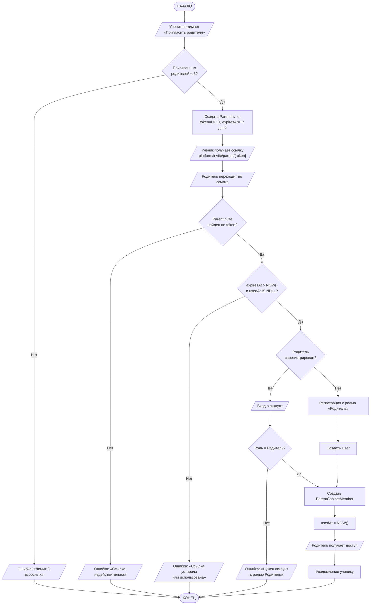
```mermaid
flowchart TD
    A([НАЧАЛО]) --> B[/"Ученик нажимает<br/>«Пригласить родителя»"/]
    B --> C{"Привязанных<br/>родителей < 3?"}
    C -- Нет --> D[/"Ошибка: «Лимит 3 взрослых»"/]
    D --> Z([КОНЕЦ])
    C -- Да --> E["Создать ParentInvite:<br/>token=UUID, expiresAt=+7 дней"]
    E --> F[/"Ученик получает ссылку<br/>platform/invite/parent/{token}"/]
    F --> G[/"Родитель переходит по ссылке"/]
    G --> H{"ParentInvite<br/>найден по token?"}
    H -- Нет --> I[/"Ошибка: «Ссылка недействительна»"/]
    I --> Z
    H -- Да --> J{"expiresAt > NOW()<br/>и usedAt IS NULL?"}
    J -- Нет --> K[/"Ошибка: «Ссылка устарела<br/>или использована»"/]
    K --> Z
    J -- Да --> L{"Родитель<br/>зарегистрирован?"}
    L -- Нет --> M["Регистрация с ролью «Родитель»"]
    M --> N[Создать User]
    L -- Да --> O[/"Вход в аккаунт"/]
    O --> P{"Роль = Родитель?"}
    P -- Нет --> Q[/"Ошибка: «Нужен аккаунт<br/>с ролью Родитель»"/]
    Q --> Z
    P -- Да --> R[Создать ParentCabinetMember]
    N --> R
    R --> S["usedAt = NOW()"]
    S --> T[/"Родитель получает доступ"/]
    T --> U[Уведомление ученику]
    U --> Z
```

#### Алгоритм 2: Отзыв доступа родителя

```mermaid
flowchart TD
    A([НАЧАЛО]) --> B[/Ученик нажимает «Отозвать доступ»/]
    B --> C[/Подтверждение: «Вы уверены?»/]
    C --> D{Подтвердил?}
    D -- Нет --> Z([КОНЕЦ])
    D -- Да --> E[Удалить ParentCabinetMember]
    E --> F[Инвалидировать сессию\nродителя для кабинета]
    F --> G[Уведомление родителю]
    G --> Z
```

***

## Модуль M7: Токены и подписки

### Тарифы

| Тариф | Кредиты/мес | Цена | Для кого |
|---|---|---|---|
| Пробный | 5 000 | Бесплатно | Любой новый ученик |
| Lite | 50 000 | 990 ₽/мес | B2C, базовый |
| Pro | 200 000 | 1 590 ₽/мес | B2C, активный |
| Факультатив | Индивидуально | По договору | Школы (B2G) |

### Механика токенов (MVP)

- Все операции по смене тарифа и пополнению — **вручную администратором**
- Кредит = внутренняя единица платформы (не 1:1 с API-токеном)
- Кредиты тратятся на: LLM-запросы при генерации кода + LLM-вызовы внутри sandbox
- Отображение баланса в шапке ИИ-чата: «потрачено / доступно»

### После MVP — ЮKassa

- Автоматическая оплата через виджет ЮKassa
- Токены зачисляются мгновенно после оплаты через webhook
- `TokenPurchaseRequest.status` → `completed` без участия администратора

### Блок-схемы алгоритмов M7

#### Алгоритм 1: Списание кредитов за LLM-запрос

```mermaid
flowchart TD
    A([НАЧАЛО]) --> B[/LLM-запрос от ученика/]
    B --> C[Получить tokenBalance]
    C --> D{tokenBalance > 0?}
    D -- Нет --> E[/«Кредиты исчерпаны»/]
    E --> Z([КОНЕЦ])
    D -- Да --> F[Выполнить LLM-запрос]
    F --> G[Получить фактические токены]
    G --> H[стоимость = токены × коэффициент]
    H --> I[tokenBalance -= стоимость]
    I --> J[Записать TokenTransaction]
    J --> K[/Обновить баланс в интерфейсе/]
    K --> Z
```
#### Алгоритм 2: Ручное пополнение токенов администратором

```mermaid
flowchart TD
    A([НАЧАЛО]) --> B[/Ученик нажимает «Пополнить токены»/]
    B --> C[Создать TokenPurchaseRequest:\nstatus=pending]
    C --> D[/Инструкция по оплате\nученику/]
    D --> E[/Уведомление администратору/]
    E --> F{Администратор\nподтвердил оплату?}
    F -- Нет --> G[/Заявка остаётся pending/]
    G --> Z([КОНЕЦ])
    F -- Да --> H[status = completed]
    H --> I[tokenBalance += amount]
    I --> J[Записать TokenTransaction:\ndelta=+amount, reason=topup]
    J --> K[/Уведомление ученику:\n«Токены зачислены»/]
    K --> Z
    F -- Отклонить --> L[status = rejected]
    L --> M[/Уведомление ученику:\n«Заявка отклонена»/]
    M --> Z
```

***

## Модуль M8: Аналитика

### Зона ответственности
Срезы данных для всех ролей: прогресс, активность, расход ресурсов.

### 5.8.1 Аналитика ученика

- Прогресс по каждому курсу (% завершения)
- Результаты тестов: балл, количество попыток, дата
- Количество проектов и запусков
- Расход токенов по дням (график)
- Бейджи-достижения и история их получения

### 5.8.2 Аналитика учителя (по классу)

- Сводная таблица учеников: прогресс по курсам, количество проектов, последняя активность
- Результаты тестов по классу: средний балл, распределение попыток
- Активность класса за период (7 / 30 дней)
- Шаг онбординга для каждого ученика
- Список учеников, не заходивших более N дней

### 5.8.3 Аналитика администратора

- Общее количество пользователей по ролям
- Активные ученики за период (DAU / MAU)
- Расход LLM по моделям и пользователям
- Топ-10 пользователей по расходу токенов
- Мониторинг бюджета LLM: текущий расход vs лимит 5 000 ₽/мес

### Блок-схемы алгоритмов M8

#### Алгоритм 1: Формирование среза аналитики класса

```mermaid
flowchart TD
    A([НАЧАЛО]) --> B[/Учитель открывает\nаналитику класса/]
    B --> C[Получить список учеников\nпо classId]
    C --> D[Для каждого ученика:\nLessonProgress, TestResult,\nSandboxExecution]
    D --> E[Агрегировать:\n% курса, средний балл,\nколичество запусков, шаг онбординга]
    E --> F[/Отобразить сводную таблицу/]
    F --> G{Учитель применяет\nфильтр по периоду?}
    G -- Да --> H[Пересчитать агрегаты\nза выбранный период]
    H --> F
    G -- Нет --> Z([КОНЕЦ])
```

***

## Модуль M9: Уведомления

### Зона ответственности
Email и in-app коммуникации для всех ролей.

### 5.9.1 Типы уведомлений

| Событие | Канал | Получатель |
|---|---|---|
| Подтверждение email | Email | Все |
| Сброс пароля | Email | Все |
| Назначен новый курс | In-app + Email | Ученик |
| Завершён урок / модуль / курс | In-app | Ученик |
| Выполнен шаг онбординга | In-app | Ученик |
| Родитель привязан к кабинету | In-app | Ученик |
| Доступ родителя отозван | Email | Родитель |
| Еженедельный отчёт о прогрессе ребёнка | Email | Родитель |
| Заявка на пополнение токенов | In-app | Администратор |
| Токены зачислены | In-app + Email | Ученик |
| Баланс токенов < 20% от тарифа | In-app | Ученик |
| Бюджет LLM достиг лимита | In-app + Email | Администратор |

### 5.9.2 Настройки уведомлений

- Ученик и учитель: включить / отключить email-уведомления по каждому типу
- Родитель: частота email-отчётов (ежедневно / еженедельно / отключить) — индивидуально для каждого родителя
- In-app уведомления отключить нельзя

### Блок-схемы алгоритмов M9

#### Алгоритм 1: Отправка уведомления

```mermaid
flowchart TD
    A([НАЧАЛО]) --> B[/Событие-триггер уведомления/]
    B --> C[Определить тип канала\nдля данного типа события]
    C --> D{Канал?}

    D -- In-app --> E[Создать запись Notification]
    E --> F[/Уведомление отображается\nв колокольчике/]
    F --> Z([КОНЕЦ])

    D -- Email --> G{Email-уведомления\nвключены у получателя?}
    G -- Нет --> Z
    G -- Да --> H[Сформировать письмо\nпо шаблону типа события]
    H --> I[Отправить через Resend API]
    I --> J{Письмо\nотправлено?}
    J -- Да --> Z
    J -- Нет --> K[Повтор через 5 мин\nмакс. 3 попытки]
    K --> Z

    D -- In-app + Email --> E2[Создать запись Notification]
    E2 --> F2[/Уведомление отображается\nв колокольчике/]
    F2 --> G
```

***

# 6. Нефункциональные требования

## 6.1 Производительность

- Время отклика API (не-LLM): ≤ 300 мс (p95)
- Первый токен SSE-ответа от LLM: ≤ 3 секунд
- Запуск Python-sandbox (холодный старт контейнера): ≤ 5 секунд
- Одновременная работа: 100 активных пользователей на MVP-этапе

## 6.2 Надёжность

- Uptime: 99% в рабочие часы (пн–пт, **08:00–22:00 МСК**)
- Резервное копирование БД: ежедневно, хранение 30 дней
- Graceful degradation при недоступности LLM-провайдера: автоматический fallback

## 6.3 Безопасность

- Все данные передаются по HTTPS (TLS 1.2+)
- Пароли хранятся в виде bcrypt-хэша (cost factor 12)
- JWT хранятся в httpOnly cookies (защита от XSS)
- CSRF-защита на всех мутирующих эндпоинтах
- API-ключи провайдеров хранятся только в `.env` / Secret Manager, никогда не передаются клиенту
- Sandbox полностью изолирован: нет доступа к хост-системе и внешней сети

## 6.4 Поддержка браузеров и устройств

- **Поддерживаемые браузеры:** Chrome, Firefox, Safari, Edge (последние 2 мажорные версии)
- Минимальное разрешение экрана: **1280×720** — для полноценной работы трёхпанельного интерфейса AI IDE
- На экранах **1024–1279px** AI IDE переходит в адаптивный режим: вертикальное расположение панелей (история чата сверху, кодовый редактор снизу, консоль вывода — выдвижная панель снизу экрана)
- Остальные разделы платформы (курсы, кабинеты, аналитика) корректно отображаются от **1024px**
- Мобильная адаптация — после MVP

## 6.5 Масштабируемость

- Горизонтальное масштабирование бэкенда через Docker Compose → Kubernetes после MVP
- Статические файлы и видео — через CDN (Selectel Object Storage)
- Redis для кэширования LLM-ответов и хранения сессий

***

# 7. Технологический стек

| Уровень | Технология |
|---|---|
| Фронтенд | Next.js (React), TypeScript, TailwindCSS, TipTap, SSE-клиент |
| Бэкенд | Node.js (NestJS), TypeScript, REST API + SSE |
| База данных | PostgreSQL (основная), Redis (кэш, очереди) |
| ORM | Prisma |
| LLM-прокси | LiteLLM (Docker-контейнер) |
| Sandbox | Docker (изолированные контейнеры, Python 3.11) |
| Хранилище файлов | **Selectel Object Storage** (S3-совместимое; видео, обложки курсов) |
| Email | **Resend** (transactional email, RU-friendly) |
| Деплой (MVP) | Docker Compose на VPS |

***

# 8. Схема базы данных

## User
| Поле | Тип | Описание |
|---|---|---|
| id | UUID | PK |
| email | STRING | Уникальный |
| passwordHash | STRING | bcrypt |
| role | ENUM | student, teacher, parent, admin |
| firstName | STRING | Имя; обязательное; заполняется при регистрации |
| lastName | STRING | Фамилия; обязательное; заполняется при регистрации |
| isEmailVerified | BOOLEAN | — |
| createdAt | TIMESTAMP | — |


## StudentProfile
| Поле | Тип | Описание |
|---|---|---|
| id | UUID | PK |
| userId | UUID | FK → User |
| tokenBalance | INT | Текущий баланс кредитов |
| tokenUsed | INT | Суммарно потрачено за всё время |
| subscriptionTier | ENUM(trial, lite, pro, custom) | Тариф |
| subscriptionExpiresAt | TIMESTAMP | NULL для trial |

## TeacherProfile
| Поле | Тип | Описание |
|---|---|---|
| id | UUID | PK |
| userId | UUID | FK → User |

## Class
| Поле | Тип | Описание |
|---|---|---|
| id | UUID | PK |
| teacherId | UUID | FK → User |
| name | STRING | Название класса |
| inviteCode | STRING | Уникальный код для вступления учеников |
| recommendSystemCourses | BOOLEAN | DEFAULT true |
| createdAt | TIMESTAMP | — |

## ClassMember
| Поле | Тип | Описание |
|---|---|---|
| id | UUID | PK |
| classId | UUID | FK → Class |
| studentId | UUID | FK → User |
| joinedAt | TIMESTAMP | — |

## Course
| Поле | Тип | Описание |
|---|---|---|
| id | UUID | PK |
| title | STRING | — |
| sourceType | ENUM(system, teacher) | Системный или авторский |
| forkedFromCourseId | UUID | NULL если оригинал |
| authorId | UUID | FK → User |
| isPublished | BOOLEAN | DEFAULT false |
| isArchived | BOOLEAN | DEFAULT false |

## Module
| Поле | Тип | Описание |
|---|---|---|
| id | UUID | PK |
| courseId | UUID | FK → Course |
| title | STRING | — |
| order | INT | Порядок в курсе |

## Lesson
| Поле | Тип | Описание |
|---|---|---|
| id | UUID | PK |
| moduleId | UUID | FK → Module |
| title | STRING | — |
| videoUrl | STRING | Selectel S3-ссылка |
| textContent | TEXT | HTML от TipTap |
| order | INT | Порядок в модуле |

## Test
| Поле | Тип | Описание |
|---|---|---|
| id | UUID | PK |
| lessonId | UUID | FK → Lesson |
| passingScorePct | INT | DEFAULT 70, диапазон 50–100 |

## TestQuestion
| Поле | Тип | Описание |
|---|---|---|
| id | UUID | PK |
| testId | UUID | FK → Test |
| text | STRING | Текст вопроса |
| type | ENUM(single, multi) | — |
| correctAnswer | JSONB | Правильные ответы |
| explanation | TEXT | Пояснение после ответа |

## TestResult
| Поле | Тип | Описание |
|---|---|---|
| id | UUID | PK |
| userId | UUID | FK → User |
| testId | UUID | FK → Test |
| score | INT | % правильных ответов |
| attempt | INT | Номер попытки |
| answers | JSONB | Ответы ученика |
| completedAt | TIMESTAMP | — |

## LessonProgress
| Поле | Тип | Описание |
|---|---|---|
| id | UUID | PK |
| userId | UUID | FK → User |
| lessonId | UUID | FK → Lesson |
| startedAt | TIMESTAMP | Дата первого открытия урока; не перезаписывается при повторных открытиях |
| completedAt | TIMESTAMP | NULL до момента завершения урока |

## CourseAssignment
| Поле | Тип | Описание |
|---|---|---|
| id | UUID | PK |
| courseId | UUID | FK → Course |
| classId | UUID | FK → Class |
| assignedByTeacherId | UUID | FK → User |
| assignedAt | TIMESTAMP | — |
| isActive | BOOLEAN | DEFAULT true |

## Project
| Поле | Тип | Описание |
|---|---|---|
| id | UUID | PK |
| userId | UUID | FK → User |
| title | STRING | — |
| templateId | UUID | FK → ProjectTemplate |
| complexity | ENUM(light, heavy) | Тип для лимитов sandbox |
| status | ENUM(draft, active, archived) | — |
| currentCode | TEXT | Актуальный код |
| createdAt | TIMESTAMP | — |

## ProjectVersion
| Поле | Тип | Описание |
|---|---|---|
| id | UUID | PK |
| projectId | UUID | FK → Project |
| versionNumber | INT | 1–10, FIFO |
| code | TEXT | Снимок кода |
| description | STRING | Краткое описание |
| createdAt | TIMESTAMP | — |

## ChatMessage
| Поле | Тип | Описание |
|---|---|---|
| id | UUID | PK |
| projectId | UUID | FK → Project |
| role | ENUM(user, assistant) | — |
| content | TEXT | — |
| modelUsed | STRING | — |
| tokensUsed | INT | — |
| createdAt | TIMESTAMP | — |

## TokenTransaction
| Поле | Тип | Описание |
|---|---|---|
| id | UUID | PK |
| userId | UUID | FK → User |
| delta | INT | + начисление / − списание |
| reason | ENUM(llm_generation, llm_sandbox, topup, subscription) | — |
| modelUsed | STRING | NULL если не LLM |
| projectId | UUID | NULL если не LLM |
| createdAt | TIMESTAMP | — |

## SandboxExecution
| Поле | Тип | Описание |
|---|---|---|
| id | UUID | PK |
| userId | UUID | FK → User |
| projectId | UUID | FK → Project |
| complexity | ENUM(light, heavy) | — |
| durationSec | INT | Фактическое время |
| status | ENUM(completed, timeout, error) | — |
| startedAt | TIMESTAMP | — |

> **Индекс:** `(userId, complexity, startedAt)` — для быстрого подсчёта суточного лимита.

## TokenPurchaseRequest
| Поле | Тип | Описание |
|---|---|---|
| id | UUID | PK |
| userId | UUID | FK → User |
| amount | INT | Запрошенное количество кредитов |
| status | ENUM(pending, completed, rejected) | — |
| createdAt | TIMESTAMP | — |
| processedAt | TIMESTAMP | NULL до обработки |
| processedBy | UUID | FK → User, NULL до обработки |

## ParentCabinet
> Запись создаётся автоматически при регистрации ученика (одновременно с `StudentProfile`). Одна запись на одного ученика.

| Поле | Тип | Описание |
|---|---|---|
| id | UUID | PK |
| studentId | UUID | FK → User; UNIQUE — один кабинет на одного ученика |


## ParentCabinetMember
| Поле | Тип | Описание |
|---|---|---|
| id | UUID | PK |
| cabinetId | UUID | FK → ParentCabinet |
| userId | UUID | FK → User (родитель) |
| addedAt | TIMESTAMP | — |

## ParentInvite
| Поле | Тип | Описание |
|---|---|---|
| id | UUID | PK |
| cabinetId | UUID | FK → ParentCabinet |
| token | UUID | Уникальный токен ссылки |
| expiresAt | TIMESTAMP | createdAt + 7 дней |
| usedAt | TIMESTAMP | NULL если не использована |
| createdAt | TIMESTAMP | — |

> Ссылка формата: `https://platform/invite/parent/{token}`. Одноразовая.

## Notification
| Поле | Тип | Описание |
|---|---|---|
| id | UUID | PK |
| userId | UUID | FK → User |
| type | STRING | Тип события |
| payload | JSONB | Данные уведомления |
| isRead | BOOLEAN | DEFAULT false |
| createdAt | TIMESTAMP | — |

## ProjectTemplate
| Поле | Тип | Описание |
|---|---|---|
| id | UUID | PK |
| title | STRING | — |
| description | TEXT | — |
| systemPrompt | TEXT | Системный промт |
| starterCode | TEXT | Стартовый код |
| tags | JSONB | — |
| complexity | ENUM(light, heavy) | Тип для лимитов sandbox |

## PromptTemplate
| Поле | Тип | Описание |
|---|---|---|
| id | UUID | PK |
| title | STRING | До 60 символов |
| category | STRING | Генерация кода / Отладка / Объяснение / Улучшение / Идеи |
| content | TEXT | Текст с плейсхолдерами `{{тема}}` |
| tags | JSONB | — |
| createdAt | TIMESTAMP | — |


## Badge
| Поле | Тип | Описание |
|---|---|---|
| id | UUID | PK |
| slug | STRING | Уникальный идентификатор бейджа («first_run», «5_projects», «course_complete» и др.) |
| title | STRING | Отображаемое название бейджа |
| description | TEXT | Описание условия получения |
| iconUrl | STRING | Ссылка на иконку (Selectel S3) |

## UserBadge
| Поле | Тип | Описание |
|---|---|---|
| id | UUID | PK |
| userId | UUID | FK → User |
| badgeId | UUID | FK → Badge |
| awardedAt | TIMESTAMP | Дата и время получения бейджа |

UNIQUE(userId, badgeId)


## UserFavoritePrompt
| Поле | Тип | Описание |
|---|---|---|
| id | UUID | PK |
| userId | UUID | FK → User (только роль student) |
| promptTemplateId | UUID | FK → PromptTemplate |
| createdAt | TIMESTAMP | Дата добавления в избранное |

Уникальный составной индекс: `(userId, promptTemplateId)` — исключает дублирование.

***

# 9. Пользовательские сценарии

### Сценарий 1: Регистрация ученика и начало обучения

**Участники:** ученик, учитель.
**Предусловие:** учитель создал класс и назначил курс.

1. Ученик открывает платформу → регистрируется (email, пароль, роль «Ученик»).
2. Подтверждает email по ссылке (TTL 24 часа).
3. В кабинете видит онбординг-виджет: шаг 1 «Присоединись к классу».
4. Вводит invite-код класса → присоединяется → шаг 1 отмечен галочкой.
5. Открывает курс «Нейросети для IT-проектов: начало» → проходит Урок 1.
6. Тест: 60% с первой попытки → видит пояснения → повторяет → 80% → шаг 2 отмечен.
7. Создаёт первый проект → шаг 3 отмечен → онбординг-виджет скрывается.
8. Учитель видит в таблице класса: все три шага выполнены.

***

### Сценарий 2: Создание первого проекта учеником

**Участники:** ученик.
**Предусловие:** завершён курс, баланс кредитов > 0.

1. Ученик → «Новый проект» → шаблон «Чат-ассистент».
2. Промт: «Создай бота для изучения английских слов».
3. Выбирает модель «🐋 DeepSeek» → «Сгенерировать».
4. Ответ ИИ приходит посимвольно; код подсвечивается после завершения блока.
5. Вносит правку вручную → «Применить код» → версия №1.
6. «Запустить» → консоль: `Привет! Как переводится слово "apple"?`
7. Новый промт → «Применить код» → версия №2.
8. Сломал логику → «Откатить» → версия №1 → всё работает.

***

### Сценарий 3: Ученик работает с шаблоном «Telegram-бот (симуляция)»

**Участники:** ученик.

1. Новый проект → шаблон «Telegram-бот (симуляция)».
2. Шаблон открывается с пометкой «⚠️ Режим симуляции».
3. Промт: «Бот-помощник по математике для 8 класса».
4. ИИ генерирует код → ученик запускает.
5. В консольной панели: встроенный интерфейс «вопрос → ответ бота».
6. Ученик демонстрирует результат учителю прямо на платформе.

***

### Сценарий 4: Учитель создаёт класс и ведёт работу

**Участники:** учитель, ученики.

1. Учитель регистрируется → создаёт класс «10Б — Информатика».
2. Онбординг учителя: шаг 1 «Создай класс» — выполнен автоматически.
3. Баннер: «Рекомендуемые курсы» → форкает системный курс → шаг 2 выполнен.
4. Редактирует Урок 3 форка через TipTap: добавляет свой пример промта.
5. Назначает курс классу → раздаёт invite-код ученикам.
6. Через два дня открывает аналитику: 14/20 прошли Урок 1, средний балл 78%.
7. Находит проект ученика → открывает код → запускает → убеждается в работоспособности.

***

### Сценарий 5: Родители подключаются и наблюдают прогресс

**Участники:** ученик, мама, папа.

1. Ученик → «Пригласить родителя» → создаёт invite-ссылку (TTL 7 дней, одноразовая).
2. Мама переходит по ссылке → регистрируется с ролью «Родитель» → привязывается.
3. Ученик получает in-app уведомление → генерирует вторую ссылку для папы.
4. Папа входит в существующий аккаунт → привязывается.
5. Оба видят: прогресс 60%, 2 проекта, timeline активности за 30 дней.
6. Папа нажимает «Запустить» у проекта → видит результат в консоли (без кода).
7. В кабинете ученика: запись «Запустил проект "Чат-ассистент": папа — сегодня, 17:05».
8. Мама настраивает еженедельный email-отчёт; папа — ежедневный.

***

### Сценарий 6: Пополнение токенов

**Участники:** ученик, администратор.

1. Ученик видит in-app: «⚠️ Остаток кредитов менее 20%».
2. Нажимает «Пополнить токены» → выбирает пакет Lite (50 000 кредитов — 990 ₽).
3. Создаётся заявка `pending` → ученику показывается инструкция по оплате.
4. Ученик делает перевод → отправляет чек администратору.
5. Администратор подтверждает → 50 000 кредитов зачислены.
6. Ученик получает уведомление: «✅ Зачислено 50 000 кредитов».

***

### Сценарий 7: Аварийный стоп при превышении LLM-бюджета

**Участники:** администратор.

1. LiteLLM достигает лимита 5 000 ₽/мес.
2. Все LLM-запросы автоматически блокируются.
3. Ученики видят: «ИИ-сервис временно недоступен».
4. Администратор получает срочное in-app уведомление + email.
5. Анализирует топ-10 по расходу → при необходимости снижает лимиты.
6. Сбрасывает счётчик → платформа возобновляет работу.
