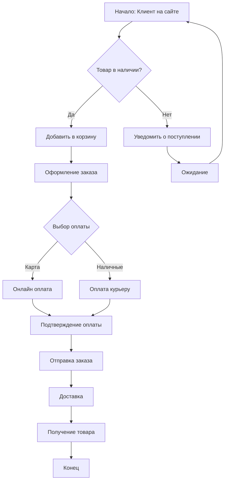
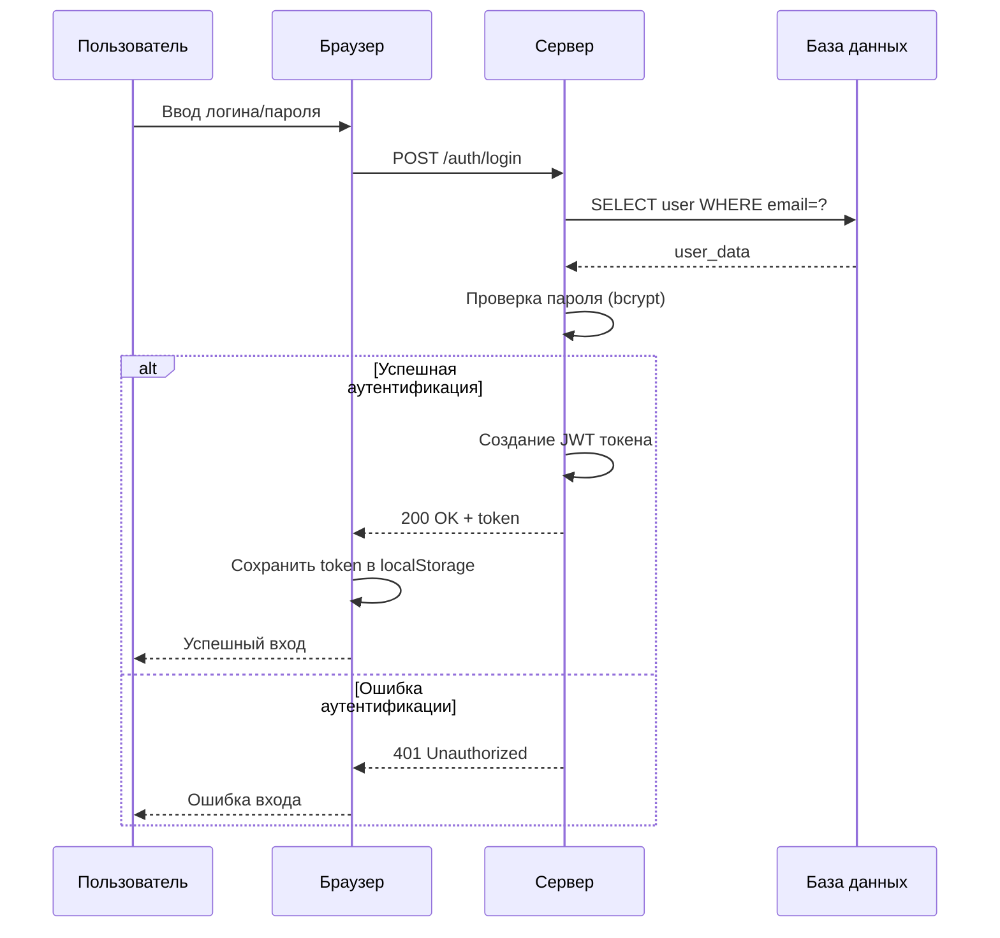
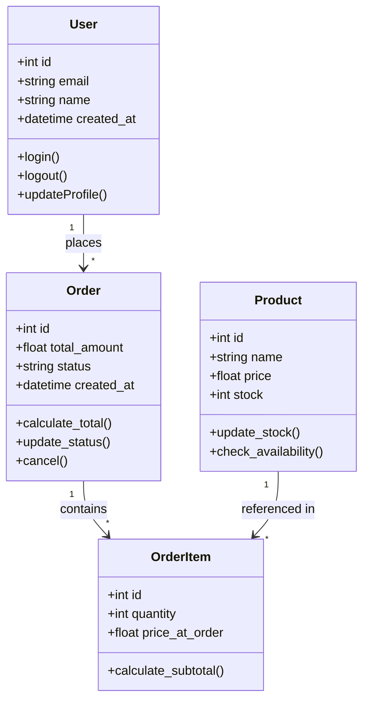
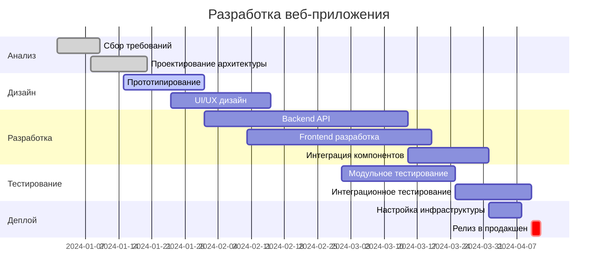
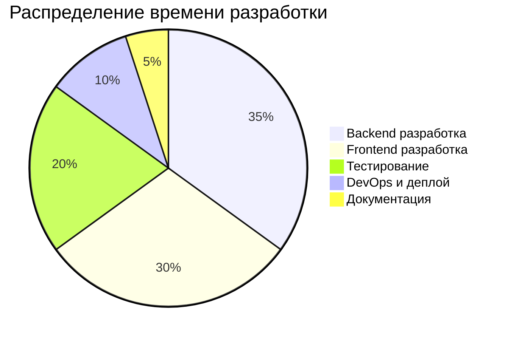
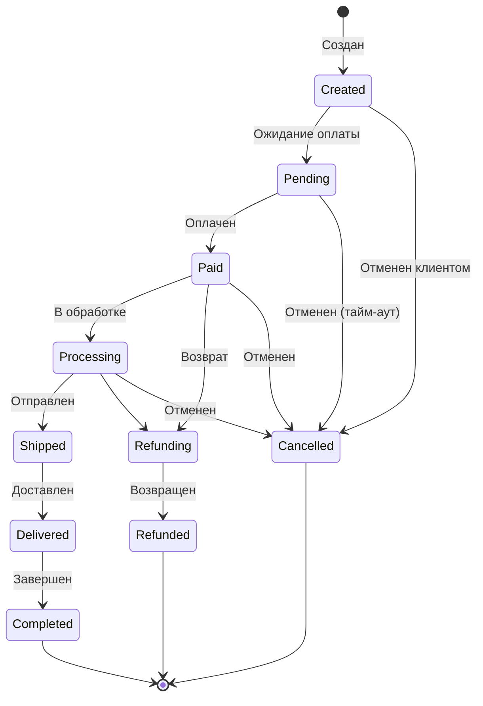

# Демонстрация Markdown to PDF конвертера

## Введение

Это демонстрационный файл, показывающий возможности конвертера Markdown в PDF с поддержкой диаграмм Mermaid.

## Блок-схема: Процесс заказа



## Диаграмма последовательности: Аутентификация

Процесс входа пользователя в систему:



## Таблица: Сравнение технологий

| Технология | Скорость | Масштабируемость | Сложность | Рейтинг |
|-----------|----------|-----------------|-----------|---------|
| FastAPI | ⭐⭐⭐⭐⭐ | ⭐⭐⭐⭐ | ⭐⭐⭐ | 9/10 |
| Django | ⭐⭐⭐⭐ | ⭐⭐⭐⭐⭐ | ⭐⭐⭐⭐ | 8/10 |
| Flask | ⭐⭐⭐⭐ | ⭐⭐⭐ | ⭐⭐ | 7/10 |
| Express.js | ⭐⭐⭐⭐⭐ | ⭐⭐⭐⭐ | ⭐⭐ | 8/10 |

## Диаграмма классов: Система управления



## График Ганта: План проекта



## Примеры кода

### Python: FastAPI endpoint

```python
from fastapi import FastAPI, HTTPException
from pydantic import BaseModel
from typing import List

app = FastAPI()

class User(BaseModel):
    id: int
    email: str
    name: str

@app.get("/api/users", response_model=List[User])
async def get_users(skip: int = 0, limit: int = 100):
    """
    Получить список пользователей с пагинацией
    """
    users = await db.users.find().skip(skip).limit(limit).to_list()
    return users

@app.post("/api/users", response_model=User, status_code=201)
async def create_user(user: User):
    """
    Создать нового пользователя
    """
    if await db.users.find_one({"email": user.email}):
        raise HTTPException(status_code=400, detail="Email already exists")

    result = await db.users.insert_one(user.dict())
    user.id = result.inserted_id
    return user
```

### JavaScript: React компонент

```javascript
import React, { useState, useEffect } from 'react';
import axios from 'axios';

function UserList() {
    const [users, setUsers] = useState([]);
    const [loading, setLoading] = useState(true);

    useEffect(() => {
        const fetchUsers = async () => {
            try {
                const response = await axios.get('/api/users');
                setUsers(response.data);
            } catch (error) {
                console.error('Error fetching users:', error);
            } finally {
                setLoading(false);
            }
        };

        fetchUsers();
    }, []);

    if (loading) return <div>Loading...</div>;

    return (
        <div className="user-list">
            <h2>Список пользователей</h2>
            <ul>
                {users.map(user => (
                    <li key={user.id}>
                        {user.name} ({user.email})
                    </li>
                ))}
            </ul>
        </div>
    );
}

export default UserList;
```

## Круговая диаграмма: Распределение задач



## Цитаты и заметки

> **Важно:** При работе с асинхронным кодом всегда используйте `async`/`await` для предотвращения блокировки event loop.

> **Совет:** Применяйте кэширование для часто запрашиваемых данных. Это может снизить нагрузку на базу данных на 70-80%.

## Списки

### Преимущества микросервисной архитектуры:

1. **Независимое развертывание** - каждый сервис можно обновлять отдельно
2. **Масштабируемость** - масштабирование только нужных компонентов
3. **Технологическая гибкость** - разные языки для разных сервисов
4. **Отказоустойчивость** - изоляция сбоев

### Недостатки:

- Сложность управления множеством сервисов
- Необходимость в service discovery
- Усложнение мониторинга и отладки
- Распределенные транзакции

## Диаграмма состояний: Жизненный цикл заказа



## Заключение

Этот конвертер позволяет создавать профессиональные PDF-документы из Markdown с полной поддержкой:

- ✅ Сложных диаграмм Mermaid
- ✅ Таблиц с форматированием
- ✅ Подсветки синтаксиса кода
- ✅ Автоматического масштабирования диаграмм
- ✅ Красивого оформления

**Все диаграммы автоматически масштабируются и никогда не разрываются на несколько страниц!**
